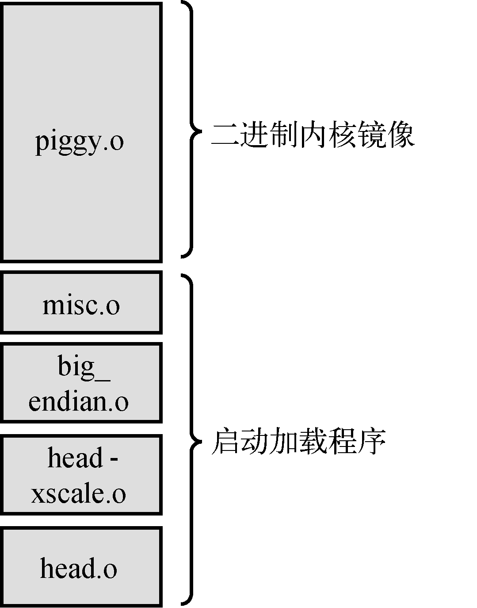

### 5.1.3　启动加载程序

不要将它与引导加载程序混淆，很多架构都使用启动加载程序（第2阶段加载程序）将Linux内核镜像加载到内存中。有些启动加载程序会对内核镜像进行校验和检查，而大多数启动加载程序会解压并重新部署内核镜像。引导加载程序和启动加载程序之间的区别也很简单：当硬件单板加电时，引导加载程序获得其控制权，根本不依赖于内核。相反，启动加载程序的主要作用是作为裸机引导加载程序和Linux内核之间的粘合剂。启动加载程序负责提供合适的上下文让内核运行于其中，并且执行必要的步骤以解压和重新部署内核二进制镜像。这类似于PC架构中的主加载程序和次加载程序的概念。

图5-2清晰地解释了这个概念。启动加载程序与内核镜像拼接在一起，用于加载。

<b class="my_markdown">图5-2　针对ARM XScale的合成内核镜像</b>

在我们研究的这个例子中，启动加载程序包含了图5-2中显示的二进制镜像。这个启动加载程序完成以下功能：

+ 底层的、用汇编语言实现的处理器初始化，这包括支持处理器内部指令和数据缓存、禁止中断并建立C语言运行环境。这部分功能由 `head.o` 和 `head-xscale.o` 完成。
+ 解压和重新部署镜像，这部分功能由 `misc.o` 完成。
+ 其他与处理器相关的初始化，比如 `big-endian.o` ，将特定处理器的字节序设置为大端字节序。

值得注意的是，我们这里研究的细节专门针对ARM/XScale架构的内核实现。每种架构的具体细节都不同，虽然概念类似。使用与此类似的分析方法，可以了解你自己所用架构的需求。

