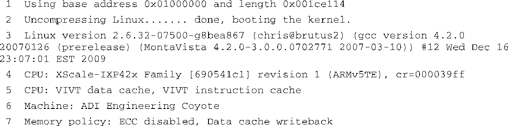
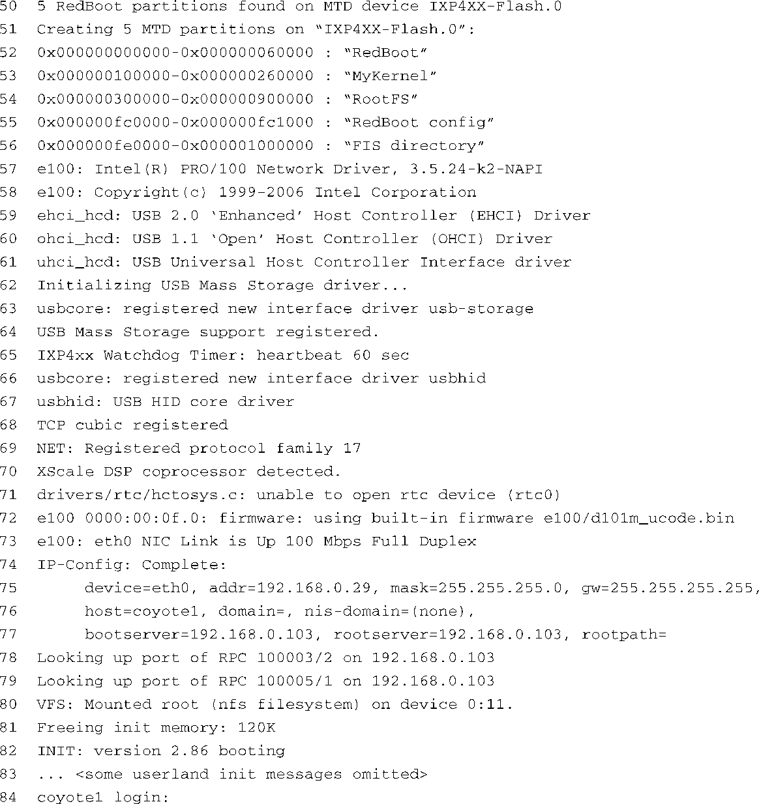

### 5.1.4　引导消息

也许你见过在一台PC工作站上引导（启动）某种桌面Linux发行版（如Red Hat或SUSE Linux）的情景。在PC自身的BIOS消息之后，你会看到很多由Linux输出的控制台消息，表明它正在初始化各个内核子系统。实际上，引导信息中的大部分都与架构及机器类型无关。在早期的引导消息中，有两条比较有趣，它们分别是内核版本字符串和内核命令行，我们很快就会介绍。在嵌入式系统上启动Linux时的情况与PC工作站类似，代码清单5-3显示了在ADI Engineering公司的Coyote参考平台上启动Linux时的一些内核引导信息，该参考平台以英特尔XScale IXP425处理器为基础。我们在代码清单中添加了行号，便于引用。

代码清单5-3　IPX425上的Linux引导信息

正如代码清单5-3中所显示的，内核会在系统启动时输出很多有用的信息。我们在下面几节中详细研究这些输出信息。第1行是由板卡上的引导加载程序Redboot产生的。第2行是由我们在前面介绍过的启动加载程序产生的。这行消息具体是由源文件.../arch/arm/boot/compressed/misc.c中的函数 `decompress_kernel()` 产生的。我们在前面提到过，由misc.c编译生成的misc.o负责内核镜像的解压。

代码清单5-3中的第3行就是所谓的内核版本字符串。这是内核本身输出的第一行信息。内核在进入函数 `start_kernel()` （这个函数在源文件.../init/main.c中）之后，首先执行的几行代码中包括下面这行：

这行代码输出了我们刚刚提到的内核版本字符串，也就是代码清单5-3中的第3行。这个版本字符串中包含了很多与内核镜像有关的信息：

+ 内核版本，Linux版本2.6.32-07500-g8bea867<a class="my_markdown" href="['#anchor058']">[8]</a>；
+ 编译内核时使用的用户名/机器名（chris@brutus2）；
+ 工具链信息：gcc版本4.2.0，由MontaVista Software提供；
+ 构建号（#12）；
+ 编译内核镜像时的日期和时间。

<a class="my_markdown" href="['#ac058']">[8]</a>　2.6.32之后的数字是一个标签，来自内核构建系统中的版本字符串；它们和这里讨论的内容不相关。4.1.1节解释了这个机制。

这些信息在开发过程和后期生产中都有用。在以上所列信息中，除了构建号之外，其他信息的含义都一目了然。构建号仅仅是一个工具，开发人员将它加在版本字符串中，以表示在这次构建和上次构建之间，除了日期和时间不同以外，还有些更显著的变化。开发人员一般使用这种方法来自动跟踪构建轨迹。可以看到，在这个例子中，这次构建是一系列构建中的第12次，而代码清单5-3第3行中的#12表明了这一点。构建号保存在名为.version的隐藏文件中，这个文件位于Linux内核源码顶层目录。构建号会由构建脚本.../scripts/mkversion自动递增。简而言之，它是一个数字的字符串标签，当内核代码有重大变化并重新编译时会自动递增。注意，执行 `make mrproper` 时，这个值会重置为#1。

