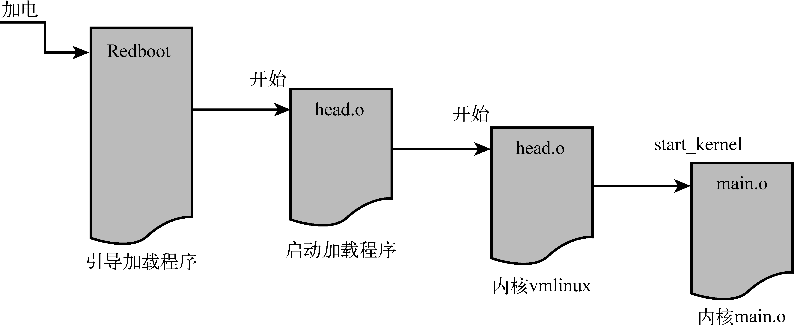

### 5.2　初始化时的控制流

现在你已经理解了合成内核镜像的组成结构及其成员，让我们研究一下一个完整的启动周期（从引导加载程序到内核）中的控制流。正如我们在第2章中所讨论的，引导加载程序是一种底层软件，存储在系统的非易失性内存（闪存或ROM）中。当系统加电时它立刻获得控制权。它通常体积很小，包含一些简单的函数，主要用于底层的初始化、操作系统镜像的加载和系统诊断。它可能会包含读写内存的函数，以检查和修改内存的内容。它也可能会包含底层的板卡自检程序，包括检测内存和I/O设备。最后，引导加载程序还包含了一些处理逻辑，用于将控制权转交给另一个程序，一般是操作系统，比如Linux。

我们在本章的例子中使用了基于ARM XScale的参考平台，其中包含了名为Redboot的引导加载程序。当系统第一次加电时，这个引导加载程序开始执行，然后会加载操作系统。当引导加载程序部署并加载了操作系统镜像（这个镜像可能存储在本地的闪存中，硬盘驱动器中，或通过局域网或其他设备）之后，就将控制权转交给那个镜像。

对于这个特定的XScale平台，引导加载程序将控制权转交给启动加载程序的 `head.o` 模块，如图5-3所示。

<b class="my_markdown">图5-3　ARM引导时的控制流</b>

我们前面讨论过，处于内核镜像之前的启动加载程序有个很重要的任务：创建合适的环境，解压并重新部署内核，并将控制权转交给它。从启动加载程序直接将控制权转交给内核主体中一个模块，对于大多数架构，这个模块的名称都是 `head.o` 。不幸的是，由于历史和人为原因，启动加载程序和内核主体都包含了一个名为 `head.o` 的模块，这会让嵌入式Linux的开发新手感到困惑。启动加载程序中的 `head.o` 模块改名为 `kernel_bootstrap_loader_head.o` 也许更加合适，但我怀疑内核开发者不会接受这个改变。实际上，最新的Linux 2.6源码树中包含了超过25个名为head.S的源文件和差不多70个名为head*.S的源文件。这也是你需要了解内核源码树的另一个原因。

图5-3以图形化的方式显示了控制流。当启动加载程序完成它的工作后，将控制权转交给内核主体的 `head.o` ，之后再转到文件main.c中的函数 `start_kernel()` 。

