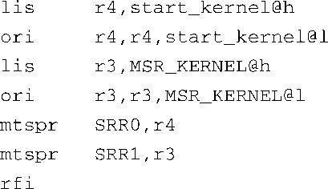

### 5.2.2　内核启动：main.c

内核自身的 `head.o` 模块完成的最后一个任务就是将控制权转交给一个由C语言编写的，负责内核启动的源文件。我们会在本章剩余部分花大量篇幅来介绍这个重要的文件。

每个架构的 `head.o` 模块在转交控制权时会使用不同的方法，汇编语言的语法也不同，但它们的代码结构是类似的。对于ARM架构，如下所示，非常简单：

<a class="my_markdown" href="['#anchor0512']">[12]</a>

<a class="my_markdown" href="['#ac0512']">[12]</a>　主流Linux内核将一部分公共代码分离出来放到了head-common.S中，然后使用 `include` 指令将它集成到head.S中。函数 `start_kernel()` 就是在这里被调用的。

对于Power架构，大致如下：

在这里，我们就不深究汇编语言语法的具体细节了，这两个例子的结果是一样的。控制权从内核的第一个对象模块（ `head.o` ）转交至C语言函数 `start_kernel()` ，这个函数位于文件.../init/main.c中，内核从这里开始了它新的生命旅程。

任何想深入理解Linux内核的人都应该仔细研究main.c文件，研究它是由哪些部分组成的，以及这些成员是如何初始化或实例化的。汇编语言之后的大部分Linux内核启动工作都是由main.c来完成的，从初始化第一个内核线程开始，直到挂载根文件系统并执行最初的用户空间Linux应用程序。

函数 `start_kernel()` 目前是main.c中最大的一个函数。大多数Linux内核初始化工作都是在这个函数中完成的。此处的目的是要突出那些在嵌入式系统开发环境中有用的部分。再说一遍，如果想更系统地理解Linux内核，花时间研究一下main.c是个很好的方法。

