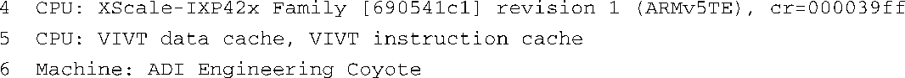

### 5.2.3　架构设置

.../init/main.c中的函数 `start_kernel()` 在其执行的开始阶段会调用 `setup_arch()` ，而这个函数是在文件.../arch/arm/kernel/setup.c中定义的。该函数接受一个参数——一个指向内核命令行的指针（我们在前面介绍过内核命令行，在下一节还会详细讲述）：

该语句调用一个与具体架构相关的设置函数，Linux内核支持的每种主要架构都提供了这个函数，它负责完成那些对某种架构通用的初始化工作。函数 `setup_arch()` 会调用其他识别具体CPU的函数，并提供了一种机制，用于调用高层特定CPU的初始化函数。 `setup_processor()` 是这方面的一个例子，由 `setup_arch()` 直接调用，位于文件.../arch/arm/kernel/setup.c中。这个函数会验证CPU的ID和版本，并调用特定CPU的初始化函数，同时会在系统引导时向控制台打印几行相关信息。

我们可以在代码清单5-3中找到类似的打印信息，具体是第4行至第6行的内容，为了便于查看，下面重新列出了这几行：

在这里，你可以看到CPU类型、ID字符串和版本，这些信息都是从处理器核心直接读取的。接着是处理器缓存和机器类型的详细信息。在这个例子中，基于IXP425的Coyote参考板上包含了一个XScale-IXP42x版本1的处理器，它采用ARMv5TE架构，并包含VIVT（virtually indexed，virtually tagged）型的数据和指令缓存。

架构设置函数最后的工作中有一项是完成那些依赖于机器类型的初始化。不同架构采用的机制有所不同。对于ARM架构，可以在.../arch/arm/mach-*系列目录中找到与具体机器相关的初始化代码文件，具体的文件取决于机器类型。MIPS架构同样也包含很多目录，具体与它支持的硬件平台有关。对于Power架构，其platforms目录包含了特定机器的代码文件。

