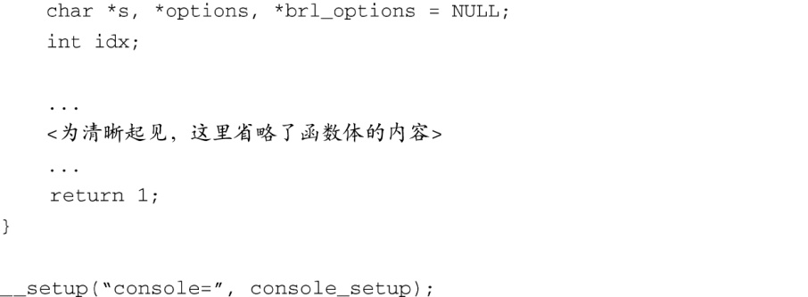
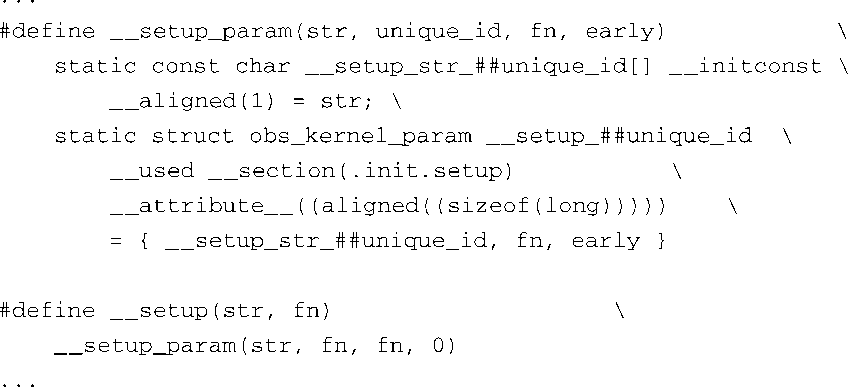
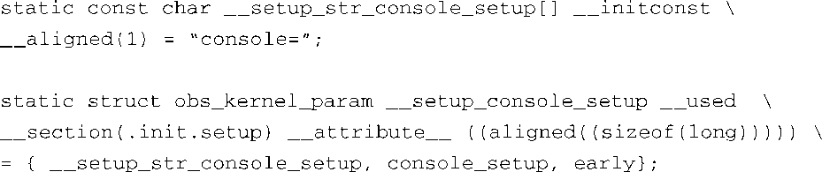
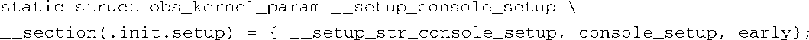
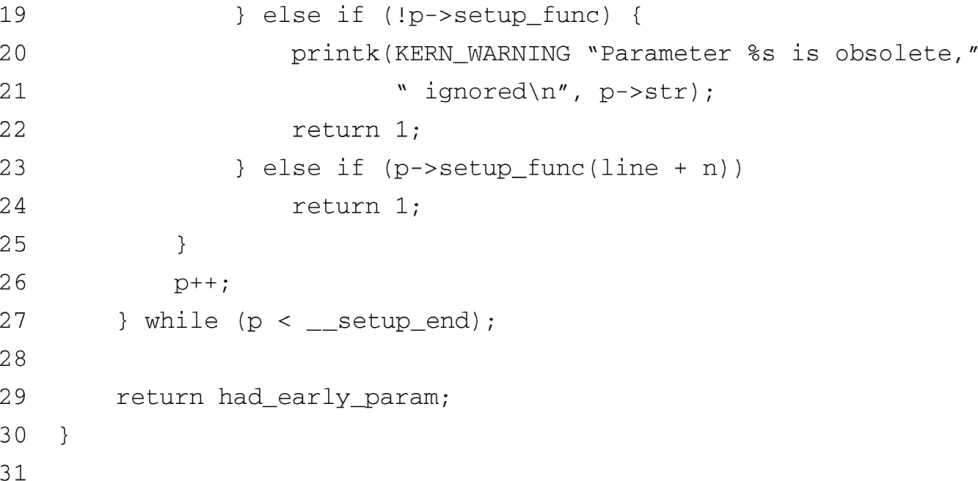

### 5.3　内核命令行的处理

在设置了架构之后，main.c开始执行一些通用的早期内核初始化工作，并显示内核命令行。为了便于查看，这里重新列出了代码清单5-3中第9行的内容：

在这个简单的例子中，命令行中的 `console=ttyS0` 指示内核在串行端口设备ttyS0（一般是第一个串行端口）上打开一个控制台，波特率为115 200bit/s。命令行中的 `ip=dhcp` 指示内核从一个DHCP服务器获取其初始IP地址，而 `root=/dev/nfs` 则是让内核通过NFS协议来挂载一个根文件系统。（我们将在第12章中介绍DHCP，并在第9章和第12章中介绍NFS，现在只讨论内核的命令行机制。）

Linux一般是由一个引导加载程序（或启动加载程序）启动的，它会向内核传递一系列参数，这些参数称为内核命令行。虽然你不会真正地使用shell<a class="my_markdown" href="['#anchor0513']">[13]</a>命令行来启动内核，但很多引导加载程序都可以使用这种大家熟悉的形式向内核传递参数。在有些平台上，引导加载程序不能识别Linux，这时可以在编译的时候定义内核命令行，并硬编码到内核的二进制镜像中。在其他平台上（比如一个运行Red Hat Linux的桌面PC），用户可以修改命令行的内容，而不需要重新编译内核。这时，bootsrap loader（对于桌面PC，这是指Grub或Lilo）从一个配置文件生成内核命令行，并在系统引导时将它传递给内核。这些命令行参数相当于一种引导机制，用于设置一些必需的初始配置，以正确引导特定的机器。

<a class="my_markdown" href="['#ac0513']">[13]</a>　shell是一种命令行形式的人机界面，Linux系统上常用的shell是Bash。——译者注

Linux内核中定义了大量的命令行参数。内核源码的.../Documentation子目录中有一个名为kernel-parameters.txt的文件，其中按照字典顺序列出了所有的内核命令行参数。回忆一下我们之前关于内核文档的一个警告：内核的变化远远快于它的文档。使用这个文件作为指南，而不是权威参考。虽然这个文件中记录了上百个不同的内核命令行参数，但这个列表不一定是完整的。因此，你必须直接参考源代码。

内核命令行参数使用的基本语法规则很简单，从代码清单5-3中的第9行就可以明显看出来。内核命令行参数有几种不同的形式，可以是单个单词，一个键/值对，或是 `key=value1,value2,...` 这种一个键和多个值的形式。这些参数是由其使用者具体进行处理的。命令行是全局可访问的，并且可以由很多模块处理。我们前面说过，mian.c中的函数 `start_kernel()` 在调用函数 `setup_arch()` 时会传入内核命令行作为函数的参数，这也是唯一的参数。通过这个调用，与架构相关的参数和配置就被传递给了那些与架构和机器相关的代码。

设备驱动程序的编写者和内核开发人员都可以添加额外的内核命令行参数，以满足自身的具体需要。下面让我们来看看这个机制。遗憾的是，在使用和处理命令行的过程中会涉及一些复杂的内容。首先，原来的机制已弃用，取而代之的是一个更加健壮的实现机制。另外，为了完全理解这个机制，你需要理解复杂的链接器脚本文件<a class="my_markdown" href="['#anchor0514']">[14]</a>。

<a class="my_markdown" href="['#ac0514']">[14]</a>　也不是非常复杂，但大多数人并不需要理解链接器脚本文件的内容，嵌入式工程师需要理解。GNU LD的文档中对其有详细的描述，参见本章末尾的参考文献。

###  `__setup` 宏

考虑一下如何指定控制台设备，这可以作为一个使用内核命令行参数的例子。我们希望在系统引导过程的早期阶段初始化控制台，以便我们可以在引导过程中将消息输出到这个目的设备上。初始化工作是由一个名为 `printk.o` 的内核对象完成的。这个模块的C语言源文件位于.../kernel/printk.c。控制台的初始化函数名为 `console_setup()` ，并且这个函数只有一个参数，就是内核命令行。

现在的面临的问题是如何以一种模块化和通用的方式传递配置参数，我们在内核命令行中指定了控制台相关的参数，但要将它们传递给需要此数据的相关设置函数和驱动程序。实际上，问题还要更复杂一些，因为一般情况下，命令行参数在较早的时候就会用到，在模块使用它们之前（或就在此时）。内核命令行主要是在main.c中处理的，但其中的启动代码不可能知道对应于每个内核命令行参数的目标处理函数，因为这样的参数有上百个。我们需要的是一种灵活和通用的机制，用于将内核命令行参数传递给它们的使用者。

文件.../include/linux/init.h中定义了一个特殊的宏，用于将内核命令行字符串的一部分同某个函数关联起来，而这个函数会处理字符串的那个部分。我们现在使用代码清单5-3中的内核命令行作为例子，说明一下 `__setup` 宏是如何工作的。

从前面的内核命令行（代码清单5-3中的第9行）中可以看到，以下这部分字符串是传给内核的第一个完整的命令行参数：

对于这个例子来说，参数的实际含义并不重要。我们的目的是要说明这个机制，所以如果你不理解这些参数或它们的值，不用在意。

代码清单5-4是文件.../kernel/printk.c中的一个代码片段。我们省略了函数体的内容，因为这和我们的讨论无关。代码清单5-4中最重要的部分就是最后一行，调用 `__setup` 宏。这个宏需要两个参数，在这里，我们传入了一个字符串字面量和一个函数指针。传递给 `__setup` 宏的字符串字面量是 `console=` ，这正好是内核命令行中有关控制台参数的前8个字节，而这并非巧合。

代码清单5-4　设置控制台的代码片段

你可以将 `__setup` 宏看做是一个注册函数，即为内核命令行中的控制台相关参数注册的处理函数。实际上是指，当在内核命令行中碰到 `console=` 字符串时，就调用 `__setup` 宏的第二个参数所指定的函数，这里就是调用函数 `console_setup()` 。但这个信息是如何传递给早期的设置代码的呢？这些代码在模块之外，也不了解控制台相关的函数。这个机制巧妙而复杂，并且依赖于编译链接时生成的列表。

具体的细节隐藏在一组宏当中，这些宏设计用于省去繁琐的语法规则，方便地将段属性（或其他属性）添加到一部分目标代码中。这里的目标是建立一个静态列表，其中的每一项包含了一个字符串字面量及其关联的函数指针。这个列表由编译器生成，存放在一个单独命名的ELF段中，而该段是最终的ELF镜像 `vmlinux` 的一部分。理解这个技术很重要，内核中的很多地方都使用这个技术来完成一些特殊处理。

现在让我们具体看一下 `__setup` 宏的情况。代码清单5-5是头文件.../include/linux/init.h中的一部分代码，其中定义了 `__setup` 系列的宏。

代码清单5-5　init.h中 `__setup` 系列宏的定义

代码清单5-5就是笔者所认为的繁琐的语法规则！回想一下代码清单5-4的内容，原来的 `__setup` 宏调用看上去像下面这样：

编译器的预处理器对这个宏展开后，会生成下面的语句：

为了提高可读性，我们使用UNIX系统中的续行符（\）将宏展开的结果拆分成多行。

这里使用了几个宏，现在对它们做简要介绍。 `__used` 宏指示编译器生成函数或变量，即使是优化器不使用该函数或变量<a class="my_markdown" href="['#anchor0515']">[15]</a>。 `__attribute__ ((aligned))` 宏指示编译器将结构体对齐到一个特定的内存边界上——在这里是按 `sizeof(long)` 的长度进行对齐。将这两个宏去掉以进行简化，下面列出了简化后的结果：

<a class="my_markdown" href="['#ac0515']">[15]</a>　通常，如果一个变量定义成静态变量，在当前的编译单元中不会得到引用。因为这些变量不是显式引用的，如果不加上 `__used` 宏，就会有告警信息。

经过简化之后，我们可以看到这个机制的核心部分。首先，编译器生成一个字符数组（字符串指针），名为 `__setup_str_conscole_setup[]` ，并将其内容初始化为 `conscole=` 。接着，编译器生成一个结构体，其中包含3个成员：一个指向内核命令行字符串（就是刚刚声明的字符数组）的指针，一个指向设置函数本身的指针，和一个简单的标志。这里最为关键的一点就是为结构体指定了一个段属性（ `__section` ）。段属性指示编译器将结构体放在ELF对象模块的一个特殊的段中，名字为 `.init.setup` 。在链接阶段，所有使用 `__setup` 宏定义的结构体都会汇集在一起，并放到 `.init.setup` 段中，实际的结果是生成了一个结构体数组。代码清单5-6是文件.../init/main.c中的一个代码片段，其中显示了如何访问和使用这块数据。

代码清单5-6　内核命令行的处理

稍作解释就可以很容易地看懂这段代码。这个函数只有一个参数，就是内核命令行字符串的相关部分。内核命令行字符串是由文件.../kernel/params.c中的函数解析的。在我们所讨论的例子中，line会指向字符串 `"console=ttyS0,115200"` ，它是内核命令行的一部分。两个外部结构体指针 `__setup_start` 和 `__setup_end` 是在链接器脚本中定义的，而不是在C语言源文件或头文件中定义的。这两个标签标记一个结构体数组的起始和结尾，这个数组就是放置在目标文件的 `.init.setup` 段中的类型为 `obs_kernel_param` 的结构数组。

代码清单5-6中的代码通过指针 `p` 扫描所有结构体，并找到一个与内核命令行参数匹配的结构体。在这个例子中，这段代码寻找与字符串 `console=` 匹配的结构体。找到相关的结构体后，会调用结构体中的函数指针成员，即调用函数 `console_setup()` ，并将命令行字符串的剩余部分（即字符串 `ttyS0,115200` ）传给它，作为这个函数的唯一参数。对于内核命令行中的每个部分，这个过程都重复一次，直到处理完内核命令行的所有内容。

我们刚才讲述的这个技术——也就将多个对象汇聚到名为ELF的特殊段中——在内核代码的很多地方都得到了使用。另一个使用这个技术的例子是 `__init` 系列宏，这些宏用于将所有一次性的初始化函数放到对象文件的同一个段中。还有一个与之类似的宏，名为 `__initconst` ，用于标记一次性使用的数据，在 `__setup` 宏中就使用了它。使用这些宏进行标记的初始化函数和数据会被汇集到名为ELF的特殊段中。当这些一次性初始化函数和数据使用完毕后，内核就会释放它们所占用的内存。在系统引导过程接近尾声的时候，内核会输出一条常见消息：Free init memory: 296K。每个人的衡量标准也许会有所不同，但三分之一兆字节已经很多了，完全值得我们花费一些精力使用 `__init` 系列宏。这就是在前面声明 `__setup_str_console_setup[]` 时使用 `__initconst` 宏的目的。

你也许一直都对此感到困惑：符号的名字都是以 `obsolete_` 开头的。这是因为内核开发人员正在用一种更通用的机制取代这种命令行处理机制，用于同时注册引导时间和可加载模块的参数。目前，内核代码中还有数百个参数是使用 `__setup` 宏进行声明的。不过，新开发的代码有可能会使用文件.../include/linux/moduleparam.h中定义的一系列函数——特别是 `module_param*` 系列宏。我们将在第8章介绍设备驱动程序时详细解释它们。

为了保持向后兼容，新的机制在解析函数<a class="my_markdown" href="['#anchor0516']">[16]</a>中包含了一个参数，它是一个未知的函数指针。因此，  `module_parms*` 系列宏不认识的参数被认为是未知的，而它们将会在开发人员的控制下由旧的机制来处理。研究一下文件.../kernel/params.c中的优美代码，并看一下文件.../init/main.c中对函数 `parse_args()` 的调用，上面所说的内容就很容易理解了。

<a class="my_markdown" href="['#ac0516']">[16]</a>　这里的解析函数是指文件.../kernel/params.c中的函数 `parse_args()` 。——译者注

最后还有一点要提一下， `__setup` 宏在展开后会生成一个 `obs_kernel_param` 结构体，而这个结构体中包含了一个用作标志的成员，我们要说的就是这个标志的作用。研究一下代码清单5-6中的代码就会比较清楚了。结构体中这个标志的名字是 `early` ，用于表示特定命令行参数是否已经在早期的引导过程中被处理过了。有些命令行参数特意用于引导早期，而这个标志提供了一种实现早期解析算法的机制。你可以在文件main.c中找到一个名为 `do_early_param()` 的函数，该函数遍历一个由链接器生成的数组并进行处理，而这个数组中的每个成员都是由 `__setup` 宏展开生成的，并且标记为早期处理（early成员的值不为0）。这允许开发者对引导过程中参数的处理时机进行一些控制。

