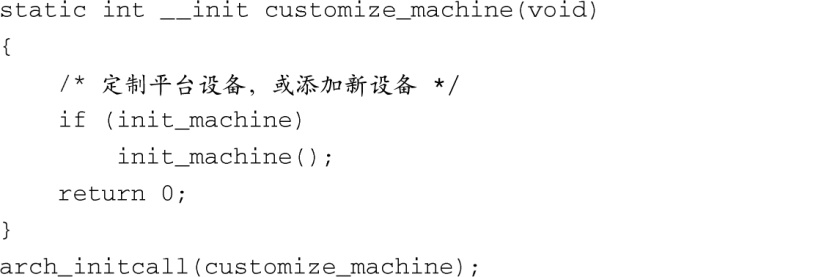
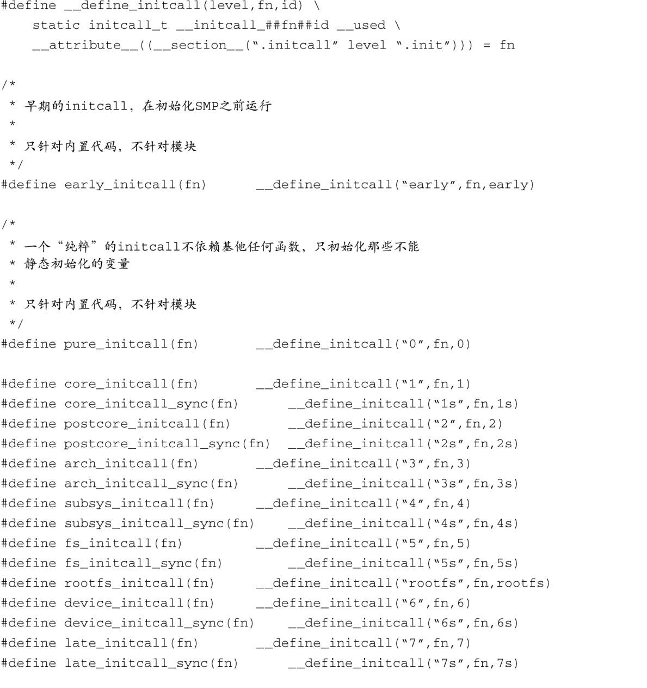

### 5.4　子系统初始化

很多内核子系统的初始化工作都是由main.c中的代码完成的。有些是通过显式函数调用完成的，比如调用函数 `init_timers()` 和 `console_init()` ，它们需要很早就被调用。其他子系统是通过一种非常类似 `__setup` 宏的技术来初始化的，我们在前面介绍过这种技术。简而言之，链接器首先构造一个函数指针的列表，其中的每个指针指向一个初始化函数，然后在代码中使用一个简单的循环，依次执行这些函数。代码清单5-7显示了这一过程。

代码清单5-7　一个简单的初始化函数



这个代码片段来自文件.../arch/arm/kernel/setup.c。该简单的函数用于对某个特定的硬件板卡进行一些定制的初始化。

###  `*__initcall` 系列宏

在代码清单5-7所示的初始化函数中，有两点值得我们注意。首先，函数定义使用了 `__init` 宏。正如我们前面所说的，这个宏为函数指定了 `section` 属性，因此编译器会将函数放在 `vmlinux` （ELF格式文件）的一个名为 `.init.text` 的段中。回想一下这样做的目的——将这个函数放在目标文件的一个特殊的段中，不需要这个函数的时候，内核就可以回收它所占用的内存空间。

需要注意的另外一点是紧跟在函数定义后面的宏： `arch_initcall(customize_machine)` 。文件.../include/linux/init.h中定义了一系列宏，这个宏是其中之一。代码清单5-8中列出了这些宏。

代码清单5-8　 `initcall` 系列宏





类似于前面介绍的 `__setup` 宏，这些宏声明了一个基于函数名的数据项。它们同样也使用了 `section` 属性，从而将这些数据项放置到vmlinux（ELF格式文件）中一个特别命名的段中。这种方法的好处是main.c可以调用任意子系统初始化函数，而不需要对此子系统有任何的了解。除此以外的唯一办法，我们前面提到过，就是在main.c中添加内核中所有子系统的相关信息，而这会使main.c的内容非常混乱。

可以从代码清单5-8中推导出段名称是 `.initcallN.init` ，其中的N是定义的级别，从1~7。同时也注意一下这7个级别都有一个段的名字是以s结尾的。这是针对那些同步（synchronous）的 `initcall` 。每个宏都定义了一个数据项（变量），宏的参数是一个函数地址，并且这个函数地址的值被赋给了该数据项。以代码清单5-7和代码清单5-8为例，代码清单5-7的最后一行展开后会像下面这样（为了简化，我们省略了 `section` 属性）：

```c
static initcall_t __initcall_customize_machine[17] = customize_machine;

```

<a class="my_markdown" href="['#ac0517']">[17]</a>　这里的变量名应该是 `__initcall_customize_machine3` 。 ——译者注。

该数据项被放置在内核目标文件的名为 `.initcall3.init` 的段中。

级别的值（N）用于对所有的初始化调用进行排序。使用 `core_initcall()` 宏声明的函数会在所有其他函数之前调用。接着调用使用 `postcore_initcall()` 宏声明的函数，依次类推，最后调用使用 `late_initcall()` 宏声明的函数。

类似于 `__setup` 宏，可以将 `*_initcall` 系列宏看做一组注册函数，用于注册内核子系统的初始化函数，它们只需要在内核启动时运行一次，之后就没用了。这些宏提供了一种机制，让这些初始化函数在系统启动时得以执行，并在这些函数执行完成后丢弃其代码并回收内存。开发人员还可以为初始化函数指定执行级别<a class="my_markdown" href="['#anchor0518']"><sup class="my_markdown">[18]</sup></a>，有多达7个级别可选。因此，如果你有一个子系统依赖于另一个子系统，可以使用级别来保证子系统的初始化顺序。使用 `grep` 命令在内核代码中搜索字符串 `[a-z]*_initcall` ，你会发现这一系列宏的使用非常广泛。

<a class="my_markdown" href="['#ac0518']">[18]</a>　每个级别还相应有一个变量标记为同步（synchronous）。

关于 `*_initcall` 系列宏，还有最后一点需要说明：多级别是在开发2.6系列内核的过程中引入的。早期的内核版本使用 `__initcall()` 宏来达到这个目的。这个宏的使用仍然很广泛，特别是在设备驱动程序中。为了保持向后兼容，将这个宏定义为 `device_initcall()` ，而它是级别为6的 `initcall` 。

