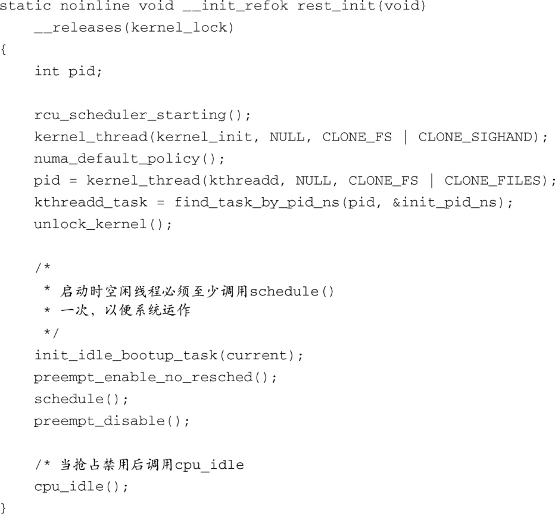

### 5.5　 `init` 线程

文件.../init/main.c中的代码负责赋予内核“生命”。函数 `start_kernel()` 执行基本的内核初始化，并显示调用一些早期初始化函数之后，就会生成第一个内核线程。这个线程就是称为 `init()` 的内核线程，它的进程ID（Process ID，PID）为1。接下来我们会了解到， `init()` 是所有用户空间Linux进程的父进程。系统引导到这个时间点时，有两个显著不同的线程正在运行：一个是函数 `start_kernel()` 代表的线程，另一个就是 `init()` 线程。前者在完成它的工作后会变成系统的空闲进程，而后者会变成 `init` 进程。代码清单5-9显示了这个过程。

代码清单5-9　内核 `init` 线程的创建

函数 `start_kernel()` 调用函数 `rest_init()` ，该过程显示在代码清单5-9中。内核的 `init` 进程是通过调用 `kernel_process()` 生成的，以函数 `kernel_init` 作为其第一个参数。init会继续完成剩余的系统初始化，而执行函数 `start_kernel()` 的线程会在调用 `cpu_idle()` 之后进入无限循环。

为什么要采用这样的结构呢？说来很有趣。你也许已经发现了 `start_kernel()` 是个相当大的函数，而且是由 `__init` 宏标记的。这意味着在内核初始化的最后阶段，它所占用的内存会被回收。而在回收内存之前，必须要退出这个函数和它所占的地址空间。解决的办法是让 `start_kernel()` 调用 `rest_init()` 。代码清单5-9中显示了函数 `rest_init()` 的内容，这个函数相对来说小很多，它会最终变成系统的空闲进程。

