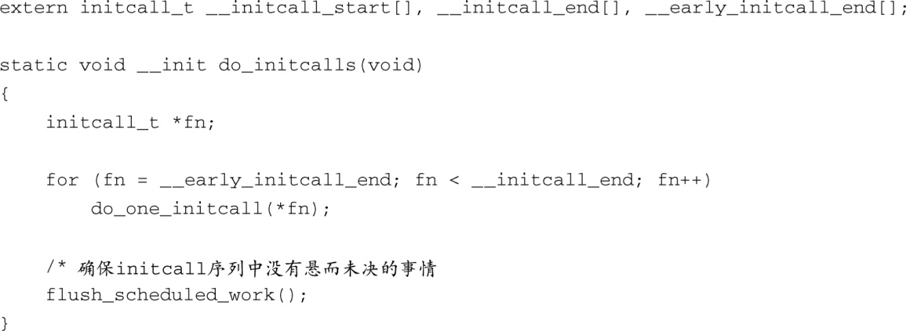

### 5.5.1　通过 `initcalls` 进行初始化

当执行函数 `kernel_init()` 的内核线程诞生后，它会最终调用 `do_initcalls()` 。我们在前面讲过， `*_initcall` 系列宏可以用于注册初始化函数，而函数 `do_initcalls()` 则负责调用其中的大部分函数。代码清单5-10中显示了相关代码。

代码清单5-10　通过 `initcalls` 进行初始化

注意一下在初始化过程中有两处代码比较类似，一处是这里的 `do_initcalls()` ，另一处是早些时候调用的 `do_pre_smp_initcalls()` 。这两个函数分别处理代码清单的不同部分， `do_pre_smp_initcalls()` 处理从 `__initcall_start` 到 `__early_initcall_end` 的部分，而 `do_initcalls()` 处理剩余的部分。在上面的代码清单中，除了标记循环边界的两个标签： `__initcall_start` 和 `__initcall_end` ，其他部分的代码一目了然。这些标签不是在C语言源文件或头文件中定义的。它们是在 `vmlinux` 的链接阶段由链接器的脚本文件定义的。这些标签标记代码清单的开始和结尾，代码清单中的成员都是使用 `*_initcall` 系列宏注册的初始化函数。顶层内核源码目录中包含一个名为System.map的文件，从中可以看到这些标签。它们都以 `__initcall` 开头，正如代码清单5-8中所示。

