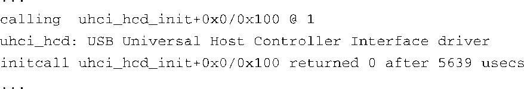

### 5.5.2　 `initcall_debug` 

`initcall_debug` 是一个很有趣的内核命令行参数，它允许你观察启动过程中的函数调用。只需在启动内核时设置一下 `initcall_debug` ，就可以看到系统输出相关的诊断消息<a class="my_markdown" href="['#anchor0519']">[19]</a>。

<a class="my_markdown" href="['#ac0519']">[19]</a>　为了看到这些调试信息，你可能需要降低系统中默认的日志级别（loglevel）。很多Linux系统管理的参考手册都对其进行了讲述。不管怎样，你会在内核日志文件中看到这些消息。

这里是一个输出信息的例子，启用调试语句后你会看到类似的信息：

这里你可以看到USB的通用主机控制器接口（Universal Host Controller Interface）驱动程序正在被调用。第一行通告了对函数 `uhci_hcd_init` 的调用，这是个设备驱动程序的初始化调用，来自USB驱动。通告之后，开始执行对这个函数的调用。第二行是由驱动程序本身打印的。第三行中的跟踪信息包含了函数的返回值以及函数调用的持续时间。

这是个查看内核初始化细节的好办法，特别是可以了解内核调用各个子系统和模块的顺序。更有趣的是函数调用的持续时间。如果你关心系统的启动时间，通过这种方法可以确定启动时间是在哪些地方被消耗的。

即使是在一个配置简单的嵌入式系统中，也会调用数十个类似的初始化函数。这个例子来自于一个ARM XScale架构的嵌入式目标板，编译内核时使用了默认配置。采用默认配置时，共有206个类似的对各个内核初始化函数的调用。

