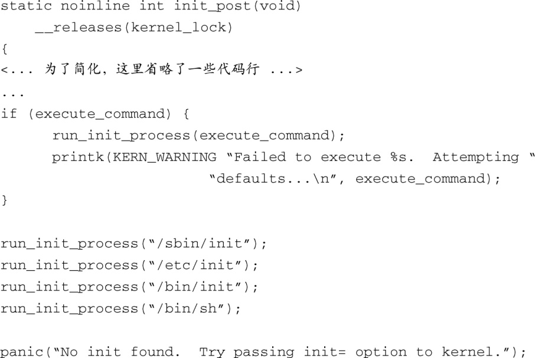

### 5.5.3　最后的引导步骤

在生成 `kernel_init()` 线程，并调用各个初始化函数之后，内核开始执行引导过程的最后一些步骤。这包括释放初始化函数和数据所占用的内存，打开系统控制台设备，并启动第一个用户空间进程。代码清单5-11显示了内核的 `init` 进程执行的最后一些步骤，代码来自文件main.c。

代码清单5-11　最后的内核引导步骤，来自文件main.c

注意一下，如果代码执行到函数（ `init_post()` ）的最后，会产生一个内核错误（kernel panic）。如果你曾经花时间在嵌入式系统上做过实验或是定制过根文件系统，毫无疑问，你肯定碰到过这个非常常见的错误消息，它通常是控制台的最后一条输出消息。这也是在各个Linux和嵌入式系统论坛上问得最多的问题（Frequently Asked Question，FAQ）之一。

无论如何，run_init_process()命令中至少有一个必须正确无误地执行。 `run_init_process()` 函数在成功调用后不会返回。它用一个新的进程覆盖调用进程，实际上是用一个新的进程替换了当前进程。它使用大家熟悉的 `execve()` 系统调用来完成这个功能。最常见的系统配置一般会生成 `/sbin/init` 作为用户空间区<a class="my_markdown" href="['#anchor0520']">[20]</a>的初始化进程。我们会在下一章详细研究这个功能。

<a class="my_markdown" href="['#ac0520']">[20]</a>　用户空间区（userland）是用户空间下针对程序、库、脚本和其他内容的一个常用术语。

嵌入式开发人员可以选择定制的用户空间区初始化程序。这就是前面代码片段中的条件语句的意图。如果 `execute_comand` 非空，它会指向一个运行在用户空间的字符串，而这个字符串中包含了一个定制的、由用户提供的命令。开发人员在内核命令行中指定这个命令，并且它会由我们前面所研究的 `__setup` 宏进行设置<a class="my_markdown" href="['#anchor0521']">[21]</a>。下面列出一个内核命令行的例子，其中涵盖我们在本章讨论的几个概念：

<a class="my_markdown" href="['#ac0521']">[21]</a>　详见main.c中的函数 `init_setup()` 。——译者注

这个内核命令行指示内核显示所有的初始化函数调用，配置初始的控制台设备为/dev/ttyS1，其数据速率为115 Kbit/s，并执行一个定制的、名为myinit的用户空间初始化进程，这个程序位于根文件系统的/sbin目录中。它还指导内核从设备/dev/hda1挂载其根文件系统，这个设备是第一个IDE硬盘。注意一下，一般来说，内核命令行中各个参数的先后次序无关紧要。下一章详细介绍用户空间的系统初始化。

