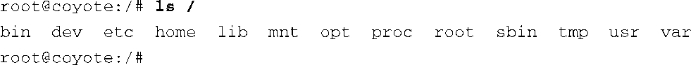

### 6.1.2　文件系统布局

考虑到存储空间有限，很多嵌入式系统的开发人员会在一个可引导设备（比如闪存）上创建一个很小的根文件系统。之后再从另一个设备（可能是硬盘或NFS服务器）上挂载一个较大的文件系统。实际上，将一个较大的根文件系统挂载到先前较小的根文件系统上并不罕见。当我们在本章的后面部分研究初始RAM磁盘（ `initrd` 和 `initramfs` ）时，你就会看到这样的例子。

一个简单的Linux根文件系统可能会包含以下顶层目录项：

.

|

|--bin

|--dev

|--etc

|--home

|--lib

|--sbin

|--usr

|--var

|--tmp

表6-1列出了这些根目录的目录项中所包含的常见内容。

<b class="my_markdown">表6-1　顶层目录项</b>

| 目录 | 内容 |
| :-----  | :-----  | :-----  | :-----  |
| bin | 二进制可执行文件，系统的所有用户都可使用<a class="my_markdown" href="['#anchor061']">[1]</a> |
| dev | 设备节点（请参见第8章） |
| etc | 本地系统配置文件 |
| home | 用户账号文件 |
| lib | 系统程序库，比如标准C程序库和很多其他的程序库 |
| sbin | 二进制可执行程序，一般留给系统的超级用户使用 |
| tmp | 临时文件 |
| usr | 次级文件系统层次结构，用于存放应用程序，一般是只读的 |
| var | 包含一些易变的文件，比如系统日志和临时配置文件 |

<a class="my_markdown" href="['#ac061']">[1]</a>　嵌入式系统往往除了根用户之外没有其他用户。

Linux文件系统层次结构的最顶端可以通过斜杠符号（/）来引用。例如，为了列出根目录的内容，你会输入以下命令：

这个命令会产生一个类似以下内容的列表：

该目录中包含了一些用于其他额外功能的目录项，包括/mnt和/proc。我们在前面说过，/proc是一个特殊的文件系统，其中包含了系统信息，而/mnt则在文件系统的层次结构中预留了一个位置，用于挂载用户设备和文件系统。注意，如果我们引用的目录项前有一个斜杠符号，则表示到达这些目录项的路径是从根目录开始的。

