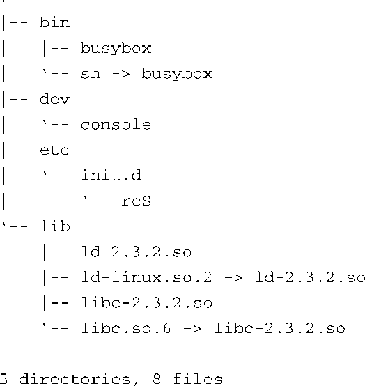

### 6.1.3　最小化的文件系统

为了说明根文件系统的具体需求，我们创建了一个最小化的根文件系统。这个例子是我们在ADI Engineering公司的Coyote参考板上创建的。代码清单6-1中显示了在这个最小化的根文件系统中使用 `tree` 命令时的输出信息。

代码清单6-1　一个最小化的根文件系统的内容

这个根文件配置使用了busybox，这是一个专门针对嵌入式系统的常用工具软件，命名也很贴切。简单来说，busybox是一个独立的二进制可执行程序，但支持很多常用的Linux命令行实用程序。busybox非常适合嵌入式系统，我们会在第11章专门讲述这个灵活的工具。

注意，代码清单6-1中的最小化文件系统中只包含了5个目录中的8个文件。这个小型根文件系统可以引导内核并为用户提供功能齐全的命令，用户可以在串行端口终端的命令提示符后输入任何busybox支持的命令。

我们从/bin开始讲述，这个目录中包含可执行程序busybox和一个名为sh的软链接（soft link），它指向busybox。稍后你就会知道必须这样做的原因。/dev中的文件是一个设备节点（第8章会详细解释设备节点），我们需要用它来打开一个控制台设备，用于系统的输入和输出。虽然不是严格必需的，/etc/init.d目录中的rcS文件是默认的初始化脚本，它会在系统启动时由busybox进行处理。当rcS文件不存在时，busybox会发出告警信息，包含rcS文件就不会有这些告警。

最后一个目录中包含了一组必需的文件，它们是两个程序库：glibc（libc-2.3.2.so）和Linux动态加载器（ld-2.3.2.so）。glibc包含标准C程序库中的函数，比如 `printf()` 和很多其他大多数的应用程序都依赖的常用函数。Linux动态加载器负责将二进制程序加载到内存中，并且，如果应用程序引用了共享库中的函数，它还需要执行动态链接。这个目录中还包含了两个软链接——ld-linux.so.2（指向ld-2.3.2.so）和libc.so.6（指向libc-2.3.2.so）。这些链接为程序库本身提供了版本保护和向后兼容，在所有的Linux系统中都可以找到。

这个简单的根文件系统构成了一个功能完备的系统。在试验它的ARM/XScale开发板上，这个小型根文件系统的大小差不多是1.7 MB。有趣的是，其中超过80%的空间是由C程序库占用的。如果需要精简嵌入式系统，可以考虑使用Library Optimizer Tool（程序库优化工具），这个软件的网址是http://libraryopt.sourceforge.net/。

