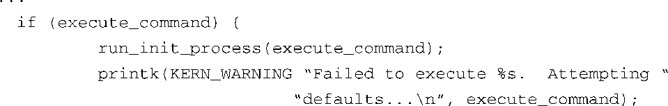
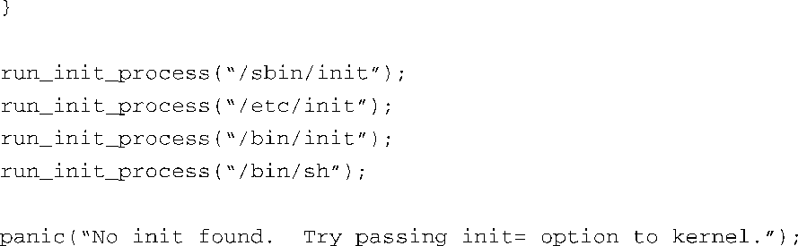

### 6.2　内核的最后一些引导步骤

前一章介绍了在系统引导的最后阶段内核执行的一些步骤。为了查看方便，代码清单6-2中列出了文件.../init/main.c中最后的代码片段<a class="my_markdown" href="['#anchor062']">[2]</a>。

代码清单6-2　最后的引导步骤，来自main.c

<a class="my_markdown" href="['#ac062']">[2]</a>　这个代码片段具体来自函数 `init_post()` ，而该函数由 `kernel_init()` 调用。——译者注

这是内核线程 `kernel_init` 所做的最后一些工作，这个线程是内核在引导的最后阶段创建的。函数 `run_init_process()` 很简短，实质上调用了函数 `execv()` ——一个内核系统调用，其行为非常有趣。如果在执行过程中没有遇到错误条件，函数 `execve()` 永远都不会返回。调用线程在执行时所占用的内存空间会被覆盖，替换成被调用程序的内存镜像。实际上，被调用的程序直接取代了调用线程，包括继承其进程ID（Process ID，PID）。

在Linux内核的开发过程中，这个初始化流程的基本结构在很长时间都没有改变过。实际上，Linux版本1.0中就包含了类似的组成结构。本质上，这就是用户空间<a class="my_markdown" href="['#anchor063']">[3]</a>处理的开始。正如你从代码清单6-2中看到的，除非Linux内核可以成功地执行这些进程中的一个，否则内核会停止执行并显示一条错误消息，这条消息就是传给系统调用 `panic()` 的参数。如果你曾经花时间开发过嵌入式系统，特别是研究过根文件系统，你一定会对内核函数 `panic()` 和这条消息非常熟悉。在因特网上搜索一下 `panic()` 错误消息，会得到大量搜索结果。学习完本章内容后，你就会很熟练地解决这个常见错误了。

<a class="my_markdown" href="['#ac063']">[3]</a>　实际上，主流Linux内核会在系统引导的早期创建一个类似用户空间的环境，用于实现一些特殊的功能，但这些内容超出了本书的范围。

注意这些程序的一个关键因素：内核认为这些程序都位于一个根文件系统中，而且这个文件系统的结构和代码清单6-1中的相关内容是类似的。因此，我们必须至少要满足内核的需求， init进程才能正常执行。

看一下代码清单6-2，这意味着至少有一个 `run_init_process()` 函数调用必须成功。我们可以看到内核会按代码中的顺序依次尝试执行4个程序。同样可以看到，如果这4个程序都没有成功执行，引导中的内核会执行可怕的 `panic()` 函数，继而崩溃。记住，文件.../init/main.c中的这个代码片段只会在引导时执行一次。如果没有成功的话，内核所能做的就只有抱怨并终止了，而这正是通过调用函数 `panic()` 来完成的。

