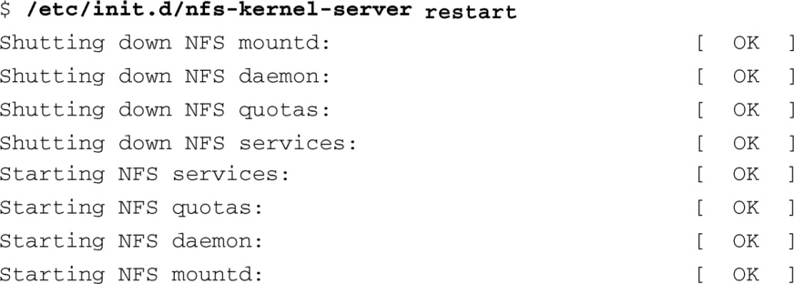
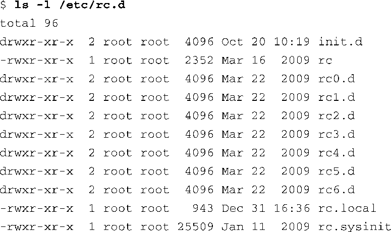
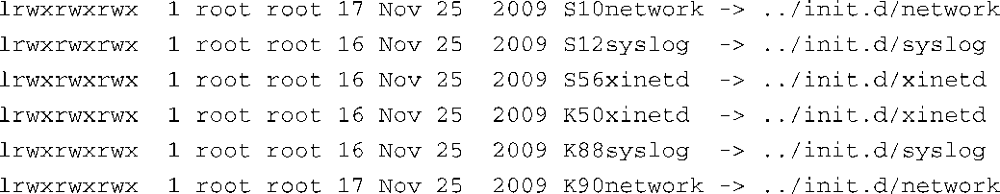

### 6.3　 `init` 进程

除非要做一些非常特别的事情，否则永远都不需要提供用户定制的初始进程，因为标准的init进程的功能就非常强大和灵活了。init程序和一组启动脚本（我们很快就会介绍它们）共同实现了通常所说的System V Init，该名字来源于最初使用这种方案的UNIX System V。现在就来介绍这个强大的系统配置及控制工具。

在前一节中，我们了解到init是内核在完成引导过程之后创建的第一个用户空间进程。我们还会认识到，在一个运行中的Linux系统中，每个进程都会和另外某个进程之间存在父子关系。init是Linux系统中所有用户空间进程的最终父进程。此外，init提供了一组默认的环境参数，比如初始的系统路径 `PATH` ，而所有其他进程都会继承这组参数。

`init` 的主要功能是根据一个特定的配置文件生成其他进程。这个配置文件通常是指/etc/inittab。 `init` 有运行级别（runlevel）的概念，可以将运行级别看做系统状态。每个运行级别是由进入这个级别时所运行的服务和生成的程序决定的。

任意时刻，init只能处于一种运行级别之中。init使用的运行级别为0~6，以及一个被称为S的特殊运行级别。运行级别0命令 `init` 终止系统，而运行级别6则会重启系统。每个运行级别一般都有一组相关的启动和关闭脚本，它们定义了系统处于这个运行级别时的动作和行为。配置文件/etc/inittab决定了系统处于某个运行级别时所执行的动作，我们稍后就会讲述这个文件。

很多Linux发行版会保留几个运行级别用于特殊目的。表6-2中描述了许多Linux发行版中常用的运行级别及其作用。

<b class="my_markdown">表6-2　运行级别</b>

| 运行级别 | 作用 |
| :-----  | :-----  | :-----  | :-----  |
| 0 | 系统关机（终止） |
| 1 | 单用户系统配置，用于维护 |
| 2 | 用户自定义 |
| 3 | 通用的多用户配置 |
| 4 | 用户自定义 |
| 5 | 多用户配置，启动后进入图形界面 |
| 6 | 系统重启 |

与运行级别相关的脚本文件一般位于目录/etc/rc.d/init.d中。在这个目录中找可以到大多数用于启动和停止相应服务的脚本。可以通过运行脚本手动配置服务，在运行脚本时需要将合适的参数（比如 `start` 、 `stop` 或 `restart` ）传递给脚本。代码清单6-3列出了重启NFS服务的例子。

代码清单6-3　重启NFS

使用过Red Hat或Fedora等桌面Linux发行版的用户，肯定在系统启动时看到过类似的输出信息。

运行级别是由它所启动的服务定义的。大多数的Linux发行版都会在目录/etc中包含一个目录结构，这些目录中包含了符号链接，指向目录/etc/rc.d/init.d中的服务脚本。与运行级别相关的目录一般位于目录/etc/rc.d中。在这个目录中，存在一系列与运行级别相关的目录，一般一个运行级别对应一个目录，目录中包含每个运行级别的启动和关闭脚本。 `init` 只是在进入和退出一个运行级别时执行这些脚本。这些脚本定义了系统状态，而 `inittab` 则是告诉 `init` 某个运行级别是和哪些脚本相关联的。代码清单6-4中显示了目录/etc/rc.d中的目录结构，这些目录中的内容分别决定了在进入和退出某个运行级别时的行为。

代码清单6-4　运行级别目录结构

每个运行级别是由目录rcN.d（其中的N是运行级别）中的脚本定义的。每个rcN.d目录都包含大量的符号链接，它们按照特定的顺序排列。这些符号链接的名字以K或S开头。以S开头的符号链接指向启动时（进入这个运行级别）执行的服务脚本。那些以K开头的符号链接指向关闭时（退出这个运行级别）执行的服务脚本。代码清单6-5中显示了一个简单的例子，这个目录中只包含了少量脚本。

代码清单6-5　简单的运行级别目录示例

根据这个目录中的内容，当进入这个假想的运行级别时，启动脚本会启动以下3个服务：network、syslog和xinetd。因为3个以S开头的脚本是按照它们名称中的数字顺序排列的，它们也会按这个顺序启动。类似地，当退出这个运行级别时，以下3个服务会终止：xinetd、syslog和network。同样，这3个以K开头的符号链接文件名中包含了一个两位数字，它们按照这个数字的顺序终止服务。在一个实际的系统中，运行级别的目录中肯定会有更多的文件。也可以在这些目录中添加文件，以适合自己的定制应用。

`init` 配置文件中定义了一个顶层脚本，它负责执行这些启动和关闭服务的脚本，我们现在就来研究一下这个顶层脚本。

