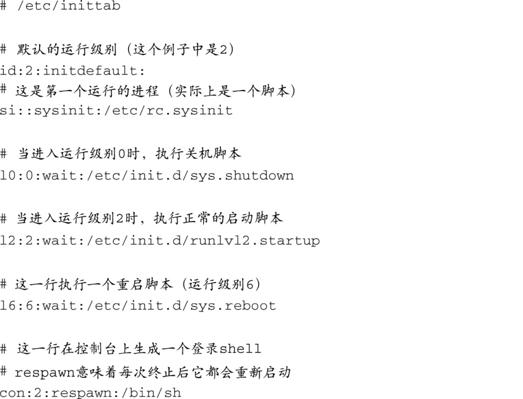
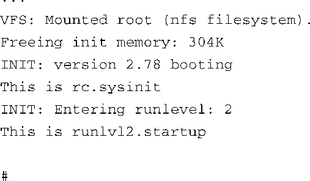

### 6.3.1　 `inittab` 

当 `init` 启动时，它会读取系统配置文件/etc/inittab。这个文件中包含了针对每个运行级别的指令，也包含了对所有运行级别都有效的指令。有很多文档讲述了这个文件以及init的行为，大多数Linux工作站的帮助手册（man page）中都有相关介绍，而且很多系统管理方面的书籍也对它们有详细的说明。我们并不想重复这些内容；我们关注的是开发人员如何为嵌入式系统配置 `inittab` 。如果想详细了解 `inittab` 和 `init` 是如何协同工作的，可以查看它们的帮助手册，只需在终端输入命令 `man init` 和 `man inittab` 就行了。

现在来看一个典型的inittab，它用于一个简单的嵌入式系统中。代码清单6-6中显示了一个系统的简单的inittab例子，该系统只支持一个运行级别，以及关机和重启。

代码清单6-6　简单的 `inittab`

这个非常简单<a class="my_markdown" href="['#anchor065']">[5]</a>的inittab脚本描述了3个不同的运行级别。每个运行级别和一个脚本相关联，脚本必须由开发人员根据运行级别的期望行为而创建。当 `init` 读取inittab文件时，执行的第一个脚本是/etc/rc.sysinit，由标签 `sysinit` 表示。然后， `init` 进入运行级别2，并执行专为运行级别2定义的脚本。在这个例子中，这个脚本是指/etc/init.d/runlvl2.startup。也许你已经从代码清单6-6中的 `:wait:` 标签猜到了， `init` 要等到这个脚本完成后才会继续。当运行级别2的脚本完成后，init会在控制台上生成一个登录shell（通过/bin/sh符号链接），正如代码清单6-6的最后一行所示。关键字 `respwan` 指示init每次发现shell已经退出时重启它。代码清单6-7显示了系统引导时的输出消息。

代码清单6-7　启动消息示例

<a class="my_markdown" href="['#ac065']">[5]</a>　这个inittab对于小型专用嵌入式系统来说是个很好的例子。

该示例中的启动脚本很简单，仅仅是为了说明概念而打印出自身功能的描述信息。当然，在实际的系统中，这些脚本会开启一些特性和服务来完成有意义的工作！学习了这个例子中的简单配置脚本后，可以在/etc/init.d/runlv12.start脚本中启动服务和应用，以适应特定的组件。同时，需要在关机和重启脚本中做相反的工作——关闭这些应用、服务和设备。下一节我们会考察一些典型的系统配置，以及启动脚本启用这些配置所必需的条目。

