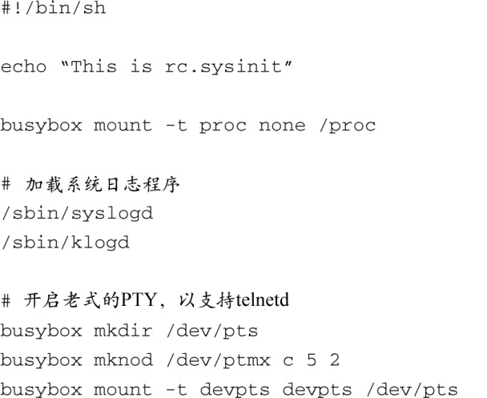
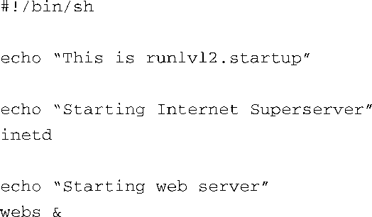

### 6.3.2　Web服务器启动脚本示例

这个示例的启动脚本虽然很简单，但它可以说明一些机制，指导你设计自己的系统启动和关机行为。这个例子基于busybox，它和 `init` 的初始化行为稍有不同。我们会在第11章中详细说明它们的不同之处。

在典型的包含Web服务器的嵌入式应用中，你也许会期望系统中有多个服务器，用于系统维护和远程访问。在这个例子中，我们启用了访问HTTP和Telent（通过 `inetd` ）的服务器。代码清单6-8中显示了一个简单的rc.sysinit脚本，用于我们假想的Web服务器设备。

代码清单6-8　Web服务器的rc.sysinit

这个简单的初始化脚本首先挂载proc文件系统，我们将会在第9章中详细介绍这个有用的子系统。接着启动系统日志程序，借此我们可以记录系统的运行信息。在系统出错时，这些日志特别有用。脚本中的最后一些条目用于开启对UNIX PTY子系统的支持，这个例子中使用的Telnet服务器在实现功能时需要该子系统。

代码清单6-9中显示了在运行级别2的启动脚本中使用的命令。这个脚本中包含的命令用于开启我们需要的服务。

代码清单6-9　运行级别2的启动脚本示例

注意到这个运行级别2的启动脚本非常简单。首先，我们开启了所谓的因特网超级服务器inetd，它会拦截常见的TCP/IP请求并启动相应的服务，本例中，启用Telnet服务的配置文件是/etc/inetd.conf；接着执行Web服务器程序webs。这就是脚本的所有内容了。虽然很简单，但这是一个可以正常工作的脚本，能够启动Telnet和Web服务。

为了完成整个配置，还需要提供一个关机脚本（参考代码清单6-6），用于在系统关机之前关闭Web服务器和因特网超级服务器。在这个简单的场景中，对于正确地关机，这些操作已经足够了。

