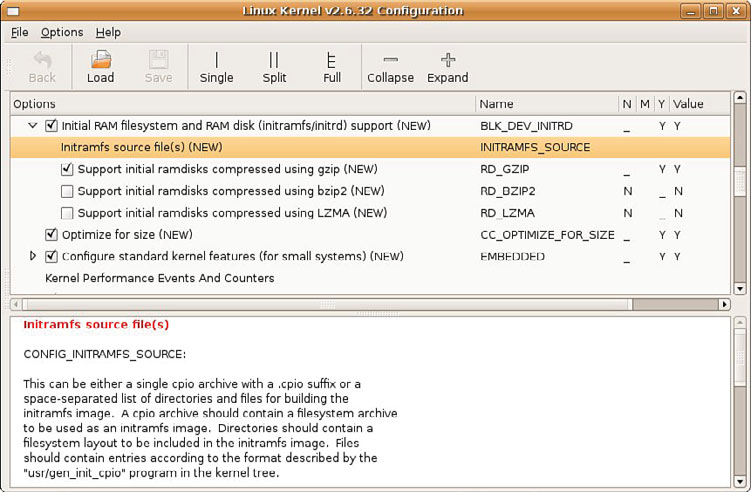

### 6.4　初始RAM磁盘

Linux内核中包含了两种挂载早期根文件系统的机制，用于执行某些和启动相关的系统初始化及配置。我们会先讨论老式方法，即初始RAM磁盘（initial ramdisk）或 `initrd` 。下一节会介绍新的方法—— `initramfs` 。

初始RAM磁盘，或简称为 `initrd` ，是一种用于启动早期用户空间处理流程的老式方法。对这个功能的支持必须编译至内核中。编译内核时，相关的选项可以在内核配置工具中找到，具体位置是General Setup中的RAM disk support选项。图6-1中显示了一个配置 `initrd` 和 `initramfs` 的例子。

<b class="my_markdown">图6-1　Linux内核配置工具</b>

初始RAM磁盘是一个功能完备的小型根文件系统，它通常包含一些指令，用于在系统引导完成之前加载一些特定的设备驱动程序。比如，在Red Hat和Ubuntu等Linux工作站发行版中，初始RAM磁盘的作用就是在挂载真正的根文件系统之前加载EXT3文件系统的设备驱动程序。 `Initrd` 一般用于加载访问真正的根文件系统必需的设备驱动程序。

