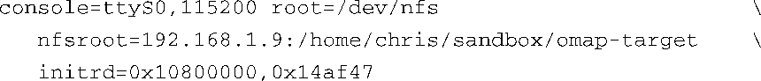

### 6.4.1　使用 `initrd` 进行引导

为了使用 `initrd` 的功能，大多数架构的引导加载程序会将 `initrd` 镜像传递给内核。常见的场景是，引导加载程序先将压缩过的内核镜像加载到内存中，接着将 `initrd` 镜像加载到另一段可用内存中。在这个过程中，引导加载程序负责在将控制权转交给内核之前，将 `initrd` 镜像的加载地址传递给内核。具体的机制取决于架构、引导加载程序和平台的实现。然而，内核必须知道 `initrd` 镜像的位置才能够加载它。

有些架构和平台会构造单个合成的二进制镜像。当引导加载程序所引导的Linux不支持加载 `initrd` 镜像时就会采用这种方式。在这种情况下，内核和initrd镜像只是简单地拼接在一起，形成一个合成的镜像。可以在内核的makefile<a class="my_markdown" href="['#anchor066']">[6]</a>中找到对这种合成镜像的引用，名称为bootpImage。目前，只有ARM架构使用了这种方式<a href="#anchor067" id="ac067">[7]</a>。

<a class="my_markdown" href="['#ac066']">[6]</a>　具体的makefile路径为.../arch/arm/Makefile。——译者注

<a class="my_markdown" href="['#ac067']">[7]</a>　这种技术基本上已经被 `initramfs` 所取代，我们下面会介绍。

那么，内核怎么知道哪里可以找到 `initrd` 镜像呢？除非引导加载程序里做了特别处理，通常情况下，使用内核命令行就可以将 `initrd` 镜像的起始地址和大小传递给内核。下面是一个在采用TI OMAP 5912处理器的ARM参考板上使用内核命令行的例子：

书页宽度有限，我们分几行来显示这个内核命令行。实际上只有一行，这里分开显示的几行用空格隔开。这个内核命令行定义了以下内核行为：

+ 在设备ttyS0上指定一个控制台，波特率为115 200；
+ 通过NFS（网络文件系统）挂载根文件系统；
+ 在主机192.168.1.9（目录为/home/chris/sandbox/omap-target）上找到NFS根文件系统；
+ 加载并挂载初始RAM磁盘，物理内存地址为0x10800000，大小为0x14AF47（1 355 591 B）。

关于这个例子还有一点要注意：通常 `initrd` 镜像都是经过压缩的。内核命令行中指定的大小是指压缩后的镜像大小。

