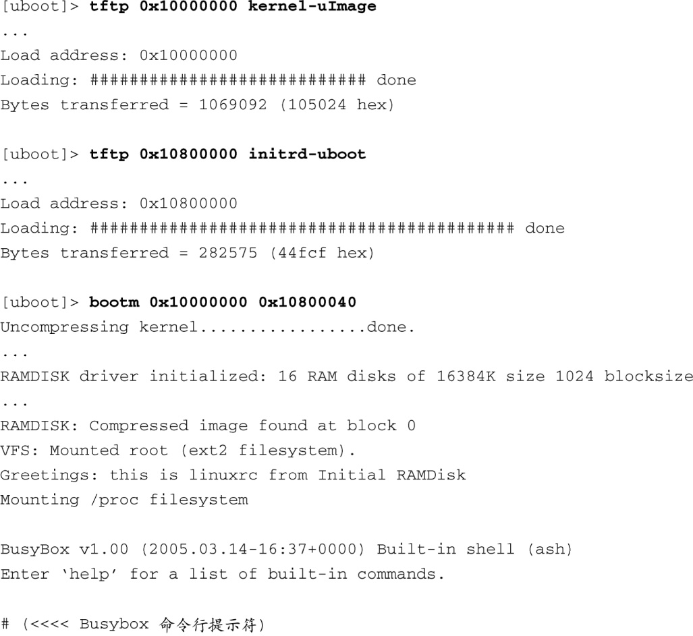

### 6.4.2　引导加载程序对 `initrd` 的支持

下面再来看一个简单的例子，它基于流行的U-Boot引导加载程序并运行在ARM处理器之上。U-Boot能够直接引导Linux内核，并且能够在引导内核镜像时包含 `initrd` 镜像。代码清单6-10显示了一个典型的使用了 `initrd` 镜像的引导过程。

代码清单6-10　ramdisk支持的内核引导

在这里简要介绍一下U-Boot引导加载程序，我们还会在下一章仔细研究。 `tftp` 命令指示U-Boot从TFTP服务器上下载内核镜像。内核镜像被下载下来后，它会被放到目标系统内存的基地址处，地址值为256 MB（十六进制表示为0x10000000）<a class="my_markdown" href="['#anchor068']">[8]</a>。接着，另一个镜像，即初始RAM磁盘镜像，也被下载下来并放到一个较高的内存地址处（在这个例子中是256 MB + 8 MB）。最后，我们运行U-Boot的 `bootm` 命令，这个命令的含义是“从内存引导”（boot from memory）。 `bootm` 命令有两个参数：一个是Linux内核镜像的地址，另一个参数是可选的，如果有的话，它是指初始RAM磁盘镜像的地址。

<a class="my_markdown" href="['#ac068']">[8]</a>　在这个特定的目标板上，物理SDRAM的起始地址为256 MB。

特别注意U-Boot引导加载程序的一个特性：它完全支持通过以太网加载内核镜像和ramdisk镜像，这个特性非常有助于开发。也可以使用别的方法将内核和ramdisk镜像加载到目标板上。可以使用基于硬件的闪存编程工具将这些镜像烧写到闪存中，或者可以使用一个串行端口，通过RS-232下载内核和文件系统镜像。然而，由于这些镜像一般都比较大（内核的大小为1 MB左右，而一个ramdisk的大小会有几十兆字节），使用这种基于以太网的TFTP下载方式，会节省大量的开发时间。无论选择哪种引导加载程序，确保它支持通过网络下载镜像。

