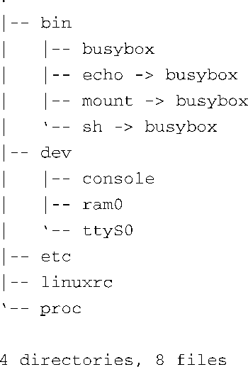

### 6.4.5　构造 `initrd` 镜像

开发嵌入式系统时会遇到的一些挑战，其中之一就是创建合适的根文件系统镜像。创建合适的 `initrd` 镜像就更具挑战性了，因为我们需要限定它的大小并专门制作。这一节将研究 `initrd` 的需求以及其文件系统的内容。

代码清单6-12是运行 `tree` 命令显示本章示例 `initrd` 镜像的内容。

代码清单6-12　 `initrd` 示例内容

正如你所看到的，它真的非常小；在未压缩的情况下，它只占用500 KB多一点的空间。 `initrd` 基于busybox，具有很多功能。这个例子中的busybox是静态链接的，不依赖于任何系统程序库。我们会在第11章讲述更多关于busybox的信息。

