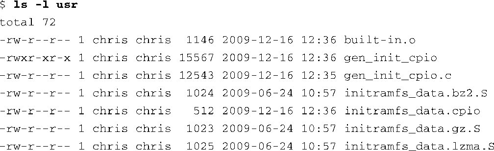
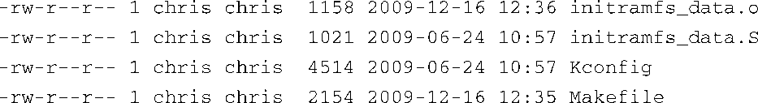
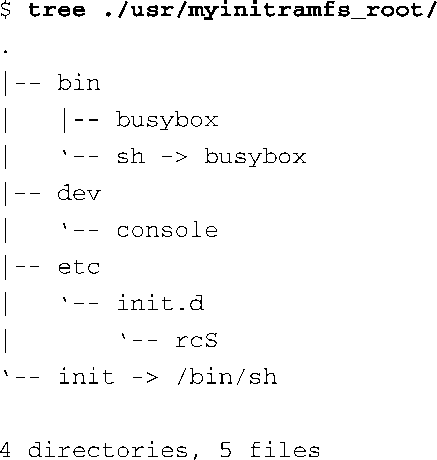

### 6.5　使用 `initramfs` 

执行早期的用户空间程序还有一种更好的机制，那就是使用 `initramsfs` 。从概念上讲，它类似于前一节中讲述的 `initrd` 。我们同样可以通过图6-1所示的配置来选择使用它。它的作用也是类似的：在挂载真正的（最后的）根文件系统之前加载一些必需的设备驱动程序。然而，它与 `initrd` 机制有很多显著区别。

`initrd` 与 `initramfs` 之间的技术实现细节差别很大。例如， `initramfs` 是在调用 `do_basic_setup()` <a class="my_markdown" href="['#anchor0612']">[12]</a>之前加载的，这就提供了一种在加载设备驱动之前加载固件的机制。想了解更多详细信息，请参考Linux内核代码中关于这个子系统的文档，具体位置为.../Documentation/filesystems/ ramfs-rootfs-initramfs.txt。

<a class="my_markdown" href="['#ac0612']">[12]</a>　 `do_basic_setup` 是在.../init/main.c中被调用的，而且它会调用 `do_initcalls()` 。这会引起驱动模块的初始化函数得到调用。第5章中详细描述了这个函数，并在代码清单5-10中显示了它的内容。

从实用的角度看， `initramfs` 更加容易使用。 `initramfs` 是一个cpio格式的档案文件，而 `initrd` 是一个使用gzip压缩过的文件系统镜像。这个简单的区别让 `initramfs` 更易使用，而且无须成为root用户就能创建它。它已经集成到Linux内核源码树中了，当构建内核镜像时，会自动创建一个默认小型（几乎没有内容） `initramfs` 镜像。改动这个小型镜像要比构建和加载新的initrd镜像容易得多。

代码清单6-13显示了Linux内核源码树的.../usr目录的内容， `initramfs` 镜像就是在这里构建的。代码清单6-13中显示的是内核构建后目录中的内容。

代码清单6-13　内核 `initramfs` 的构建目录

Linux内核源码树的.../scripts目录中有一个名为gen_initramfs_list.sh的脚本文件，其中定义了哪些文件会默认包含在initramfs档案文件中。对于最新的Linux内核，这些默认文件<a class="my_markdown" href="['#anchor0613']">[13]</a>类似于代码清单6-14中所列出的文件。

代码清单6-14　initramfs中包含的文件

<a class="my_markdown" href="['#ac0613']">[13]</a>　参考此脚本文件中的函数 `default_initramfs()` 。——译者注

这会生成一个小型的默认目录结构，其中包含/root和/dev两个顶层目录，还包含一个单独的代表控制台的设备节点。内核文档.../Documentation/filesystems/ramfs-rootfs-initramfs中详细讲述了如何指定initramfs文件系统的组成部分。总而言之，上面的代码清单会生成一个名为/dev的目录项（dir），文件权限为0755，用户ID和组ID都是0（代表root用户）。第二行定义了一个名为/dev/console的设备节点（nod），文件权限为0600，用户ID和组ID都是0（代表root用户），它是一个字符设备（c），主设备号为5，次设备号为1<a class="my_markdown" href="['#anchor0614']">[14]</a>。第三行创建了另一个目录，名为/root，规格与/dev目录类似。

<a class="my_markdown" href="['#ac0614']">[14]</a>　如果你对设备节点以及主次设备号的概念不熟悉，可以参考第8章中对这些内容的介绍。

### 定制 `initramfs` 

有两种针对特定需求定制 `initramfs` 的方法。一种方法是创建一个cpio格式的档案文件，其中包含你所需的所有文件，另一种方法是指定一系列目录和文件，这些文件会和gen_initramfs_list.sh所创建的默认文件合并在一起。你可以通过内核配置工具来为 `initramfs` 指定一个文件源。在内核配置中开启 `INITRAMFS_SOURCE` ，并将它指向开发工作站上的一个目录。图6-1中高亮显示了这个配置参数。内核的构建系统会使用这个目录中的文件作为 `initramfs` 镜像的源文件。让我们使用一个最小化的文件系统（类似于代码清单6-1中创建的文件系统）来研究一下它的机制。

首先，我们会构造一个文件的集合，其中包含了一个最小化系统所需的文件。 `initramfs` 应当是短小精干的，由此我们可以基于静态编译的busybox来构造它。静态编译busybox意味着它不依赖于任何系统程序库。除了busybox之外，我们需要的文件很少了：一个是代表控制台的设备节点，它位于名为/dev的目录中，还有一个是指向busybox的符号链接，名为init。最后，我们还要包含一个busybox的启动脚本，用于系统启动后生成一个shell与我们交互。代码清单6-15显示了这个最小化文件系统的详细内容。

代码清单6-15　最小化的 `initramfs` 内容

当我们将内核配置参数 `INITRAMFS_SOURCE` 指向这个目录时，内核会自动构建生成 `initramfs` （这会是个压缩过的cpio档案文件），并且将它链接到内核镜像中。

我们需要注意一下符号链接init的作用。当内核配置了 `initramfs` 时，它会在 `initramfs` 镜像的根目录中搜索一个名为/init的可执行文件。如果能够找到这个文件，内核会将它作为 `init` 进程执行，并设置它的PID（进程ID）为1。如果找不到这个文件，内核会略过 `initramfs` ，并继续进行常规的根文件系统处理。这一处理逻辑可以在源码文件.../init/main.c中找到。一个名为ramdisk_execute_command的字符指针中包含了指向这个初始化命令的指针，默认指向 `"/init"` 。

有一个名为 `rdinit=` 的内核命令行参数，如果设置了这个参数，那么以上字符指针就不再指向 `"/init"` 。<a class="my_markdown" href="['#anchor0615']">[15]</a>这个参数的使用类似于 `init=` 。要使用这个参数，只需在内核命令行中添加它就行了。例如，在内核命令行中设置 `rdinit=/bin/sh` 就可以直接调用shell应用busybox。

<a class="my_markdown" href="['#ac0615']">[15]</a>　可参考内核源码文件.../init/main.c中的函数 `rdinit_setup()` ，这个函数对应内核命令行的参数 `rdinit=` 。 ——译者注

