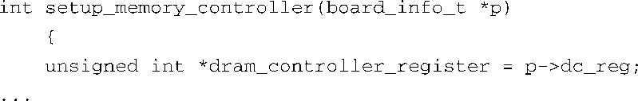
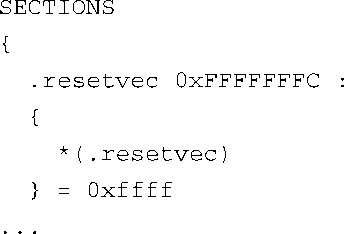
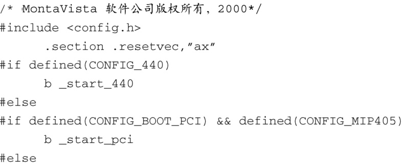

### 7.2.3　镜像的复杂性

作为应用程序的开发人员，当我们为最喜爱的平台开发应用程序时，不需要关心二进制可执行文件的内部布局。预先配置好的编译器和其他的二进制工具会生成一个二进制可执行镜像，并在其中包含给定架构所需的合适组件。链接器会在镜像中加入启动（prologue，开场白）和关闭（epilogue，收场白）代码。这些对象为你的应用程序设置了合适的执行环境，而应用程序通常是从 `main()` 函数开始执行的。

对于一个常见的引导加载程序来说，情况就大不相同了。当引导加载程序获得控制权时，并不存在上下文或执行环境。在引导加载程序初始化处理器和相关硬件之前，系统中没有任何DRAM可用。考虑一下这意味着什么。在典型的C函数中，任何局部变量都保存在内存栈中，所以像代码清单7-1中所示的函数是不可用的。

代码清单7-1　简单的使用局部变量的C函数

引导加载程序在系统加电后获得控制权时，还不存在栈和栈指针。因此，类似代码清单7-1中的简单函数很可能会使处理器崩溃，因为编译器生成的代码会在栈中创建指针 `dram_controller_register` ，并进行初始化，但栈还不存在。引导加载程序必须在调用任意C函数之前创建这个执行环境。

在编译和链接生成引导加载程序时，开发人员必须控制镜像的构造和链接。如果引导加载程序需要将其自身从闪存重新部署到RAM中，就更是如此了。开发人员必须传递很多参数给编译器和链接器，用于定义最终可执行镜像的特征和布局。以下这两个主要特征合在一起，增加了最终二进制可执行镜像的复杂度：一是代码的组织结构需要符合处理器的引导要求，另一个是执行环境，我们稍后就会介绍。

带来复杂度的第一个特征是需要组织启动代码的格式，使其符合处理器的引导步骤的要求。最初的可执行指令必须放在闪存中的一个预定位置，这个位置取决于使用的处理器和硬件架构。例如，AMCC 405GP处理器（采用Power架构）会从固定地址0xFFFF_FFFC获取其第一条机器指令。其他的处理器采用类似的方法，只是细节有所不同。有些处理器可以配置为从几个预定义位置之一获取代码，具体位置由硬件配置信号决定。

开发人员如何指定一个二进制镜像的内部布局呢？可以传递给链接器一个链接描述文件，也称为链接器命令脚本。可以将这个特殊的文件看做一份构造二进制可执行镜像的“配方”。代码清单7-2中显示了U-Boot引导加载程序使用的链接器描述文件的部分内容。我们一会儿就会讨论U-Boot。

代码清单7-2　链接器命令脚本：复位向量的设置

完整地描述链接器命令脚本所使用的语法规则超出了本书的范围。请参考本章末尾列出的GNU LD手册。现在看一下代码清单7-2，我们可以看到，脚本从这里开始定义了二进制ELF镜像的输出段。它指示链接器将名为 `.resetvet` 的代码段放置在输出镜像的固定地址处，即地址0xFFFF_FFFC。此外，它还指定这个段的剩余部分全部填充1（0xffff）。这是因为一个闪存的存储阵列在被擦除后内容全部是1。这个技术不仅降低了闪存的耗损，同时也显著提高了将数据写入闪存相应扇区的速度。

代码清单7-3显示了定义 `.resetvec` 代码段的汇编语言文件的内容，它来自最新的U-Boot发行版，位于名为.../cpu/ppc4xx/resetvec.S的汇编语言文件中。注意，在一个只有32位地址的机器中，这个代码段的长度不能超过4 B。这是因为，不论配置选项（文件中的宏）取值如何，这个代码段都只定义了1条指令。

代码清单7-3　 `.resetvec` 的源码定义

即使没有任何汇编语言的编程经验，也很容易理解这个汇编语言文件。根据特定的配置（由文件中的 `CONFIG_*` 宏指定），这个文件会生成一条无条件跳转指令（branch，在Power架构的汇编器语法中表示为b），跳转到代码主体的起始位置。这个跳转位置存放了一条长度为4 B的Power架构指令。正如我们在代码清单7-2的链接器脚本片段中所看到的，这条简单的跳转指令会被放置到输出镜像的闪存绝对地址0xFFFF_FFFC处。我们在前面提到过，405GP处理器会从这个固定的地址处获取其第一条指令。对于这个特定的架构和处理器的组合，开发人员正是通过这种方式定义了处理器会最先执行的代码。

