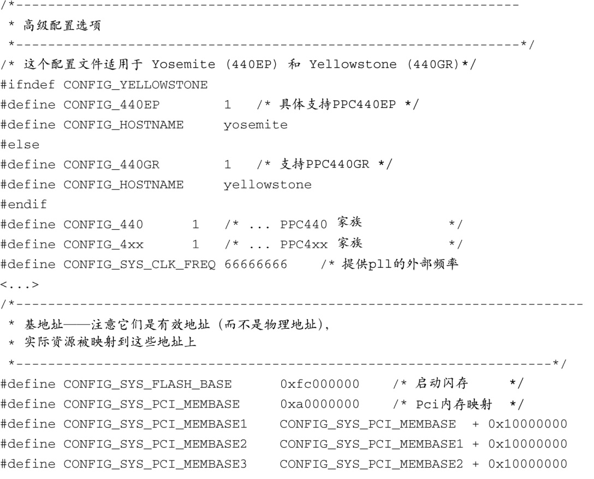
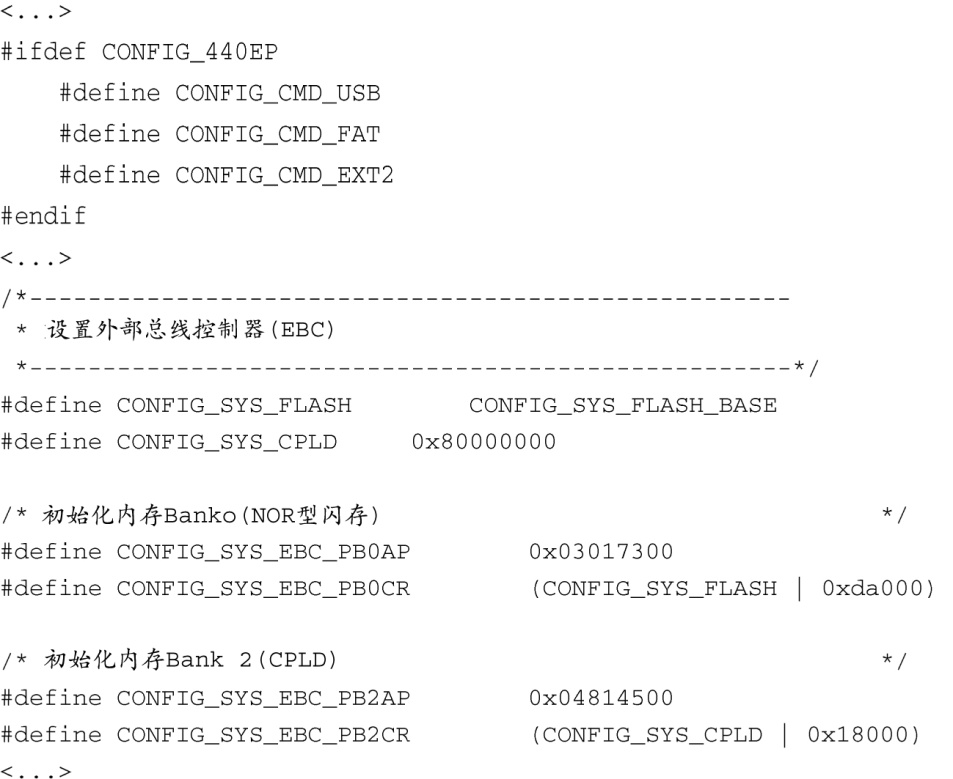

### 7.3.2　配置U-Boot

对于一个可以适用于多种处理器和架构的引导加载程序来说，必须有一些配置它的方法。和Linux内核本身一样，对引导加载程序的配置也是在编译时完成的。这种方法显著降低了二进制引导加载程序镜像的复杂度，而复杂度本身就是镜像的一个重要特征。

就U-Boot而言，与具体硬件板卡相关的配置主要包括一个针对目标平台的头文件，以及一些源码树中的软链接，它们根据目标板、使用的架构和CPU选择正确的子目录。当为某个支持的平台配置U-Boot时，可以输入以下命令：

在这里，platform代表U-Boot所支持的众多平台中的一个。这些平台配置目标都列在U-Boot源码的顶层makefile中。例如，为了配置Spectrum Digital OSK，其中包含一块TI的OMAP 5912处理器，可以使用以下命令：

这会配置U-Boot源码树并生成一些合适的软链接，它们会选择ARM作为目标架构，选择ARM926核心，并以5912 OSK作为目标平台。

为这个平台配置U-Boot的下一步是编辑针对这个板卡的配置文件。这个文件位于U-Boot源码的.../include/configs子目录中，文件名为omap5192osk.h。U-Boot源码中带的README文件描述了配置的细节，是此类信息的最佳来源。（对于U-Boot已经支持的现存板卡来说，也许没有必要编辑这个与具体板卡相关的配置文件。配置文件中的默认值足够满足需要了。但有时可能会需要做些小的修改，以更新内存或闪存的大小，因为购买的参考板的硬件配置会有变化。）

U-Boot是使用配置变量（configuration variable）进行配置的，这些变量是在一个与具体板卡相关的头文件中定义的。配置变量有两种形式。配置选项（configuration option）是通过形式为 `CONFIG_XXXX` 的宏来选择的。配置设置（configuration setting）则是通过形式为 `CONFIG_SYS_XXXX` 的宏来选择的。一般而言，配置选项（ `CONFIG_XXXX` ）是用户可配置的，并且会开启具体的U-Boot运行特性。配置设置（ `CONFIG-SYS-XXX` ）一般是与硬件相关的，并且需要底层处理器和/或硬件平台的详细信息。与具体板卡相关的U-Boot配置体现在一个头文件中，这个文件针对具体的平台，并且包含了适合底层平台的配置选项和设置。U-Boot的源码树中包含了一个目录，所有这些与具体板卡相关的配置头文件都在其中。具体的目录为.../include/configs，其中的...代表U-Boot源码树的顶层目录。

对板卡配置文件中添加定义，可以选择大量的特性和操作模式。代码清单7-4中显示了一个配置头文件<a class="my_markdown" href="['#anchor073']">[3]</a>的部分内容，这个文件针对Yosemite开发板，而它基于AMCC 440EP处理器。

代码清单7-4　U-Boot 板卡配置头文件的部分内容

<a class="my_markdown" href="['#ac073']">[3]</a>　这个文件具体是指U-Boot源码中的.../include/configs/yosemite.h。——译者注

代码清单7-4告诉我们如何为一个具体的板卡配置U-Boot。一个实际的板卡配置文件中会包含上百行类似上面列出的代码。在这个例子中，你可以看到以下这些定义：CPU（ `CONFIG_440EP` ）、板卡的名字（ `CONFIG_HOSTNAME` ）、时钟频率以及闪存和PCI基地址。代码清单中同时包含了配置变量（ `CONFIG_XXX` ）和配置设置（ `CONFIG_SYS_XXXX` ）的例子。最后几行是实际的处理器寄存器的值，用于初始化外部总线控制器，以配置内存的bank 0和bank 1。可以看到，只有在深入了解板卡和处理器之后，才能正确地设置这些值。

使用这些机制可以对U-Boot的诸多方面进行配置，包括将哪些功能编译进U-Boot（支持DHCP、内存测试、调试支持等）。这个机制可以告诉U-Boot一个给定板卡上的内存大小和类型，以及它的映射位置。你可以直接查看U-Boot的源码，特别是写得很好的README文件，以获取更多信息。

