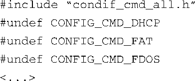

### 7.3.3　U-Boot的监控命令

U-Boot支持超过70个标准命令集，其中包含150多个不同的命令，所有命令都可以用 `CONFIG_CMD_*` 宏开启。在U-Boot中，命令集是由配置设置（ `CONFIG_*` ）宏开启的。可以参考附录A，获取最新的U-Boot版本所支持的完整命令列表。表7-1中仅显示了其中几个命令，你可以从中了解到U-Boot支持的部分功能。

<b class="my_markdown">表7-1　几个U-Boot配置命令</b>

| 命令集 | 描述 |
| :-----  | :-----  | :-----  | :-----  |
| `CONFIG_CMD_FLASH` | 与闪存相关的命令 |
| `CONFIG_CMD_MEMORY` | 内存转储、填充、复制、比较等 |
| `CONFIG_CMD_DHCP` | 支持DHCP |
| `CONFIG_CMD_PING` | 支持ping命令 |
| `CONFIG_CMD_EXT2` | 支持EXT2文件系统 |

要开启某个命令，只需定义与此命令对应的宏就行了。这些宏都定义在与具体板卡相关的配置文件中。代码清单7-4中显示了某个板卡配置文件中开启的一些命令。在那个文件中，我们可以看到如果板卡是440EP，则会定义 `CONFIG_CMD_USB` 、 `CONFIG_CMD_FAT` 和 `CONFIG_CMD_EXT2` 几个宏。

除了可以在板卡配置文件中一一定义每个 `CONFIG_CMD_*` 宏，还可以以文件.../include/config_ cmd_all.h为基础进行配置，这个文件定义了所有的命令。另一个头文件.../include/config_cmd_ default.h定义了一些有用的默认U-Boot命令集，比如 `tftpboot` （从一个tftp服务器中引导镜像）、 `bootm` （从内存中引导镜像）、 `md` 等内存工具（显示内存内容），等等。为了定义自己的命令集，你可以从默认的命令集开始，并进行必要的添加和删减。代码清单7-4在默认命令集的基础之上添加了 `USB` 、 `FAT` 和 `EXT2` 命令集。类似地，你也可以在config_cmd_all.h的基础之上进行删减。

看一下目录.../include/configs/中包含的板卡配置头文件，任何一个都可以作为学习的例子。

