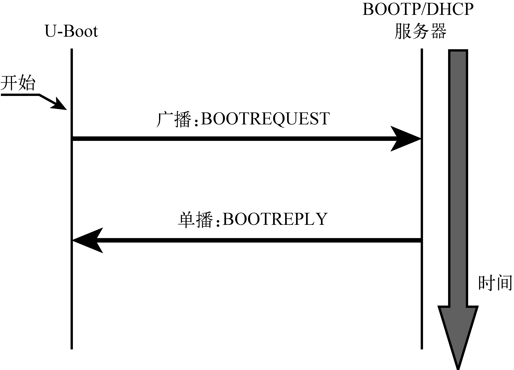
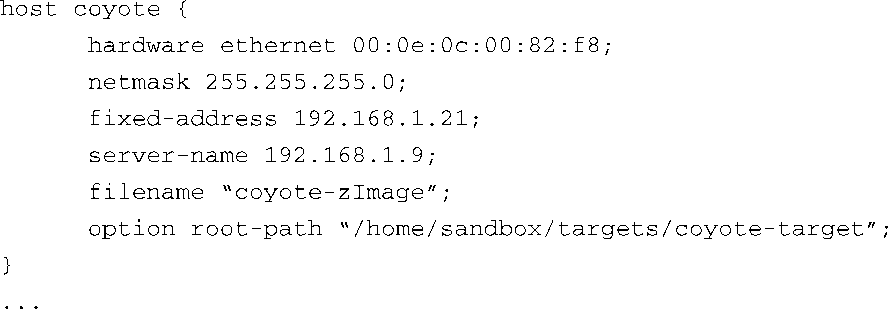

### 7.3.4　网络操作

很多引导加载程序都支持以太网接口。在一个开发环境中，这可以节省大量的时间。通过串行端口加载一个普通大小的内核镜像需要几分钟的时间，而通过以太网则只需要几秒种，特别是当板卡支持快速或吉比特以太网时就更快了。此外，当串行端口终端异常或线路上有干扰时，串行端口连接就更容易出错。

在一个引导加载程序中，还有一些更加重要的特性值得关注，这包括对BOOTP、DHCP和TFTP协议的支持。如果你对这些不熟悉，你只需知道BOOTP（Bootstrap Protocol，启动协议）和DHCP（Dynamic Host Configuration Protocol，动态主机配置协议）启用一个带以太网端口的目标设备，能够从中心服务器获取IP地址和其他网络相关的配置信息；TFTP（Trivial File Transfer Protocol，简单文件传输协议）允许目标设备从TFTP服务器上下载文件（比如一个Linux内核镜像）。本章的末尾列出了这些协议规范的参考文献。第12章中会讲述这些协议的服务器。

图7-1中显示了目标设备和BOOTP服务器之间的信息流。客户端（在这里是U-Boot）首先会发送一个广播报文，用于寻找BOOTP服务器。服务器会回复一个响应报文，其中包含客户端的IP地址及其他信息。这其中最有用的信息包括内核镜像的文件名，客户端可以用它来下载镜像。

<b class="my_markdown">图7-1　BOOTP协议中，客户端/服务器之间的握手信息</b>

实际上，现在已经没有专门的BOOTP服务器了。在你喜爱的Linux发行版中一般都会有DHCP服务器，它也支持BOOTP协议报文，并且常用于实现BOOTP服务器的功能。

DHCP协议建立在BOOTP基础之上。它可以为目标设备提供多种配置信息。实际上，信息交互常常受限于目标设备/引导加载程序中的DHCP客户端实现。代码清单7-5中显示了一个DHCP服务器的部分配置，可用于识别唯一目标设备。这段配置内容取自Fedora 2中DHCP服务器的配置文件。

代码清单7-5　DHCP目标设备的配置说明

当DHCP服务器收到目标设备发来的报文，而这个设备的硬件以太网地址和代码清单7-5中配置的地址相匹配时，它会向这个设备回复响应报文，并在其中包含这些配置信息。表7-2描述了目标设备的配置中各字段的含义。

<b class="my_markdown">表7-2　DHCP目标设备的参数</b>

| DHCP目标设备的参数 | 用途 | 描述 |
| :-----  | :-----  | :-----  | :-----  | :-----  |
| `host` | 主机名称 | DHCP配置文件中的符号标签 |
| `hardware ethernet` | 以太网硬件地址 | 目标设备以太网接口的底层以太网硬件地址 |
| `fixed-address` | 目标设备的IP地址 | 目标设备会使用的IP地址 |
| `netmask` | 目标设备的子网掩码 | 目标设备会使用的IP子网掩码 |
| `server-name` | TFTP服务器的IP地址 | 目标设备会向这个地址直接请求文件传输、根文件系统等 |
| `filename` | TFTP服务器中的文件名 | 引导加载程序可以使用这个文件来引导一个二级镜像（一般是一个Linux内核） |
| `root-path` | NFS根路径 | 定义了远端NFS根目录的网络路径 |

当目标板上的引导加载程序完成了BOOTP或DHCP的信息交换后，这些参数会用于进一步的配置。比如，引导加载程序会使用目标IP地址（ `fixed-address` ），将它的以太网端口绑定到这个IP地址上。接着，引导加载程序会使用 `server-name` 字段作为目的IP地址，向其发起文件传输的请求，以获取名为filename的文件，大多数情况下，这个文件代表一个Linux内核镜像。虽然这是最常见的使用情况，也可以用同样的方式来下载和执行一个用于生产测试和诊断固件的程序。

需要注意的是DHCP协议支持很多参数，远远多于表7-2中所描述的。它们只是在嵌入式系统中较为常见的参数。请参考本章末尾列出的DHCP规范文档，以获取完整和详细的信息。

