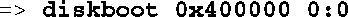
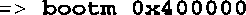

### 7.3.6　从磁盘引导

我们刚才提到，U-Boot支持好几种从磁盘子系统引导内核镜像的方法。下面这条简单的命令说明了其中支持的一种方法：

为了理解这里使用的语法规则，你必须首先理解U-Boot是怎样对磁盘设备进行编号的。这个例子中的0:0指定了设备和分区。在这个简单的例子中，U-Boot从第一个IDE设备（IDE设备0）上的第一个分区（分区0）中加载一个镜像，采用的是原始的二进制加载方式。这个镜像会被加载到系统内存中，物理地址为0x400000。

当内核镜像被加载到内存中后，可以使用U-Boot的 `bootm` （boot from memory，从内存引导）命令来引导这个内核：

