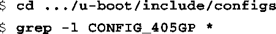
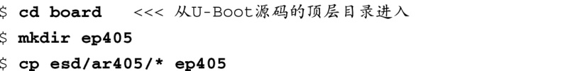
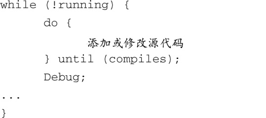

### 7.4.1　EP405的U-Boot移植

将U-Boot移植到一个不同的CPU上所采用的方法也适用于将它移植到一个新的板卡上。让我们来看一个例子。使用Embedded Planet出品的EP405参考板，它采用AMCC Power架构的405GP处理器。这个例子中使用的参考板是由Embedded Planet赞助的，配置了64 MB的SDRAM和16 MB的板载闪存。参考板上还包含了很多其他硬件设备。

首先，我们看一下这个参考板和哪个现有板卡最为接近。U-Boot源码树中的很多板卡都支持405GP处理器。进入存放板卡配置头文件的目录中，并执行 `grep` 命令，就可以找到那些支持405GP处理器的板卡：

在最新的U-Boot版本中，有28个板卡配置文件是针对405GP配置的。在考察了其中一些之后，我们选择AR405.h配置文件作为基线。它支持LXT971以太网收发器，而EP405上同样也有这个设备。我们这么做的目的是借鉴类似架构从而减少开发的工作量，这也是开源精神的体现。

我们先解决些简单的问题。我们需要一个定制的，针对405GP参考板的板卡配置头文件。将AR405.h配置文件复制到一个新文件中，并根据你的板卡重新命名，我们将它命名为EP405.h。在U-Boot顶层源码目录中使用以下命令：

复制配置头文件之后，必须创建与具体板卡相关的目录，并复制AR405参考板的相关文件。我们还不知道是否需要所有文件，这在后面的步骤中会清楚。将这些文件复制到新建的板卡目录中之后，你需要根据板卡名称编辑这些文件的名称：

现在要处理较难的部分了。开发人员Jerry Van Baren是U-Boot的贡献者，他在一封电子邮件中以幽默的语言详细描述了移植U-Boot的实际过程，这封邮件发表在U-Boot邮件列表上。他所说的用伪C语言（pseudo-C）描述的完整过程，可以在U-Boot的README文件中找到。下面的几行代码总结了移植过程中较难的部分，这里采用了Jerry的风格。

Jerry所描述的过程，正如这里所总结的，只是一个简单的真理。当你选择了一个基线，并以此为基础开始移植，你必须添加、删除和修改源代码直至它能够编译通过，并且需要进行调试直至它能够正确地运行！没有神奇的公式。在将任何引导加载程序移植到一个新的板卡上时，你都需要了解硬件和软件的诸多方面。其中的某些工作，比如设置SDRAM控制器，是相当专业和复杂的。几乎所有工作都需要详细了解底层硬件。因此，你要准备好牺牲大量娱乐时间，仔细研究处理器的硬件参考手册，以及板卡上大量其他元件的数据手册。

