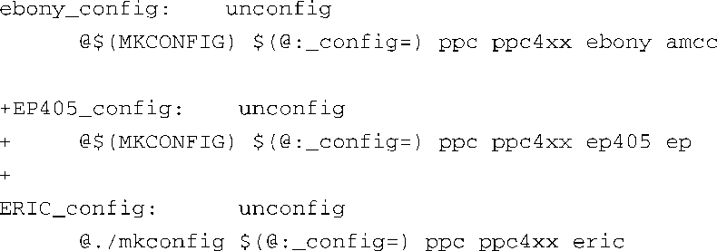

### 7.4.2　U-Boot Makefile中的配置目标

现在我们已经有了代码作为起点，我们必须对顶层的U-Boot Makefile文件做一些修改，在其中为我们的新板卡添加配置。查看makefile时，我们可以发现其中有一段用于为各种支持的板卡配置U-Boot源码树。在顶层makefile中，这一段开始于unconfig目标。我们现在就在其中添加对新板卡的支持，这样我们就可以配置它了。因为我们是以ESD AR405参考板为基础的，我们会使用它的规则（rule）作为模板来编写我们自己的规则。如果你看一下U-Boot的源码，你会发现，这些规则是在makefile中按照配置名称的字母顺序排列的。我们要成为开源社区的“良好市民”，并遵循这一规范。同样，按照U-Boot的命名规范，将我们的配置目标称为EP405_config。你需要修改顶层的makefile文件，代码清单7-6中列出了要修改的详细内容。

代码清单7-6　对Makefile所做的修改

我们插入了新的配置规则，就是代码清单中以+号（这里使用的是unified diff格式）开头的那3行。使用你喜爱的编辑器对顶层的makefile进行编辑，加入这些修改的内容。

完成了以上所说的步骤之后，我们有了一个代表起点的U-Boot源码树。可能它还不能正确编译，所以我们首先应该解决这个问题。至少编译器可以给我们一些提示，让我们知道从哪里开始下手。

