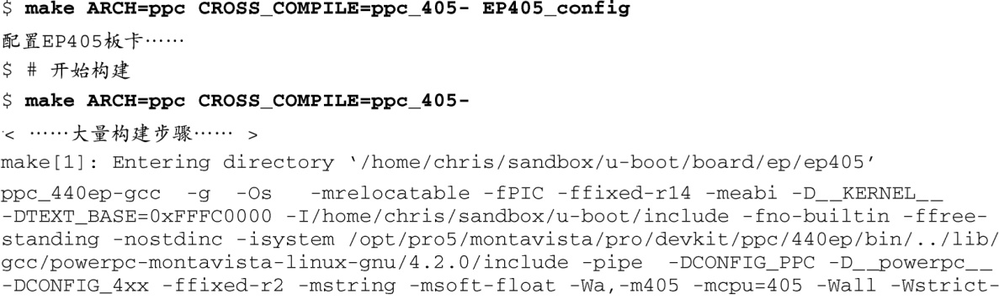
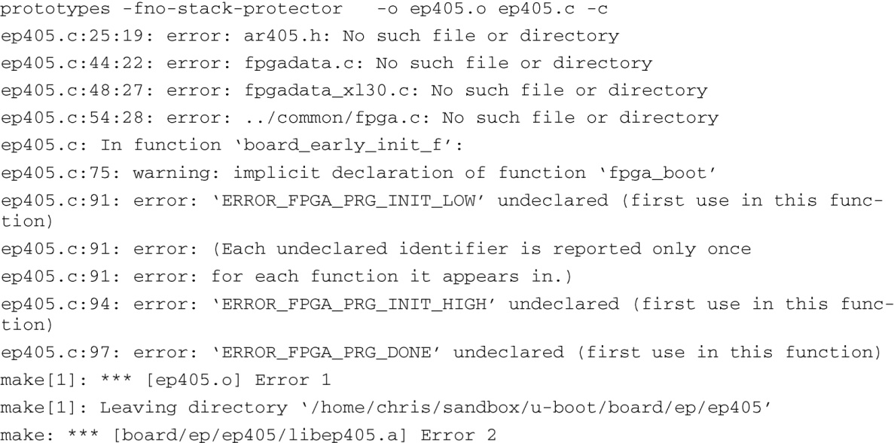

### 7.4.3　EP405的第一次构建

现在U-Boot源码树中包含了我们的候选文件。第一步是为我们新安装的EP405参考板配置构建树。使用我们刚刚在顶层makefile中添加的配置目标，就可以进行配置了。代码清单7-7给你一个起点，告诉你需要关注哪些内容。

代码清单7-7　配置和构建EP405

乍一看，我们注意到需要修改之前复制的ep405.c文件，并且修正其中的一些引用，这包括板卡头文件和对FPGA的引用。我们可以去除这些引用，因为EP405参考板并没有像AR405一样包含FPGA。这些修改应该比较简单，我们把它们作为练习留给读者完成。同样地，没有神奇的公式可用，我们需要按Jerrry所说：编辑编译不断重复，直到文件可以正确通过编译。接下来就是困难的部分了——让它真正地工作起来。让文件通过编译并不困难，编辑修改这些文件，用不了一个小时就可以让它们正确编译了。

