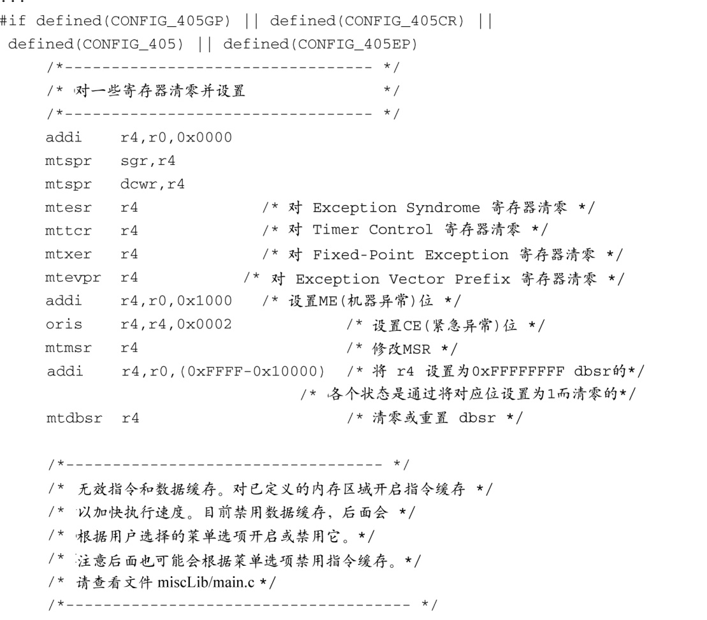
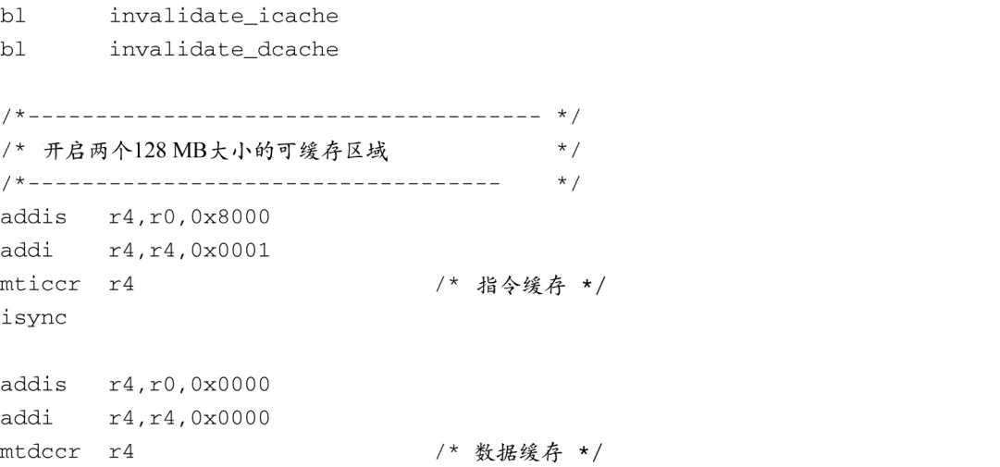

### 7.4.4　EP405 处理器初始化

移植U-Boot到新的板卡上后，它必须正确完成的首要任务是初始化处理器和内存（DRAM）子系统。复位之后，405GP处理器核心会从地址为0xFFFF_FFFC的地方获取指令。处理器核心会尝试执行获取到的指令。因为这是内存范围的顶部，这里存放的指令必定是一条无条件跳转指令。

这个处理器核心也是硬编码配置最上面的2 MB内存范围，为的是它可以不用对外部总线控制器编程就能访问这块内存，而闪存一般是附着于外部总线上的。这就对跳转指令提出了需求，它必须跳转到这个地址空间范围之内，因为在引导加载程序初始化其他内存区域之前，处理器还不能访问其他的这些内存。我们必须要跳转到地址0xFFE0_0000或以上的某个地方。我们是怎么知道这些的呢？因为我们已经阅读了405GP处理器的用户手册了！

我们刚才所描述的405GP处理器核心的行为给硬件设计人员提出了要求，他们要确保在系统加电时，将非易失性存储器（闪存）映射到最上面的2 MB内存区域中。处理器在复位时，会认为这块初始内存区域的某些属性取默认值。例如，最上面的2 MB区域会被配置为256个等待状态，3个地址到芯片选择的延时周期，3个芯片选择到输出启用的延时周期以及7个保持时间<a class="my_markdown" href="['#anchor074']">[4]</a>周期。这赋予了硬件设计者最大的自由度，他们可以选择合适的设备或方法，以便处理器复位后能够直接获取到指令代码。

<a class="my_markdown" href="['#ac074']">[4]</a>　这些数据直接来自405GP处理器的用户手册，本章的末尾列出了这个参考文献。

我们已经在代码清单7-2中看到了如何将复位向量（reset vector）安装到闪存的顶部。当我们为405GP配置U-Boot时，可以在文件…/cpu/ppc4xx/start.S中找到最先执行的代码。U-Boot的开发人员将这部分代码设计成处理器通用的。理论上，这个文件中无须有和具体板卡相关的代码。你将会看到这是如何实现的。

你不需要理解Power架构的汇编语言就能够看懂start.S中的逻辑流程。发表在U-Boot邮件列表中的很多常见问题（FAQ）都是关于修改底层汇编代码的。如果你想将U-Boot移植到一个它支持的处理器上，几乎在所有情况下，都没有必要修改这些汇编代码。这是一份成熟的代码，很多成功的移植案例都采用了这段代码。为了移植，你需要修改与具体板卡相关的代码（这是至少的）。如果你发现自己遇到了麻烦，或者你正极力改善一种成熟处理器的早期启动汇编代码，很可能你已经走错方向了。

代码清单7-8中列出了文件start.S的一部分内容，这个文件是针对4xx架构的。

代码清单7-8　U-Boot中针对4xx架构的启动代码

对于405GP处理器来说，start.S中最先执行的代码大概是从源文件三分之一的地方开始的，这里会对很多寄存器的值清零或设置初始值。接着指令缓存和数据缓存中的内容变得无效，然后开启指令缓存以加快初始的加载速度。接下来设置两个128 MB大小的可缓存的区域——一个位于高端内存（闪存区域），另一个则位于底部（通常是系统DRAM的起始位置）。U-Boot最终会被复制到这个RAM区域中，并从那里执行。这样做的原因是为了性能：从RAM中读取数据的速度要远远快于从闪存中读取数据的速度。然而，对于4xx系列CPU，开启指令缓存还有另一个微妙的原因，很快你就会知道。

