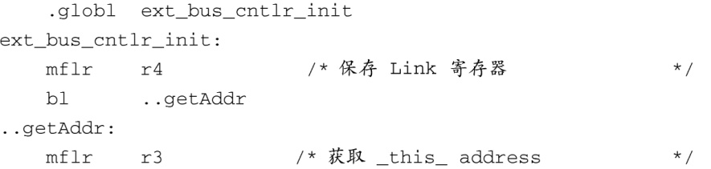
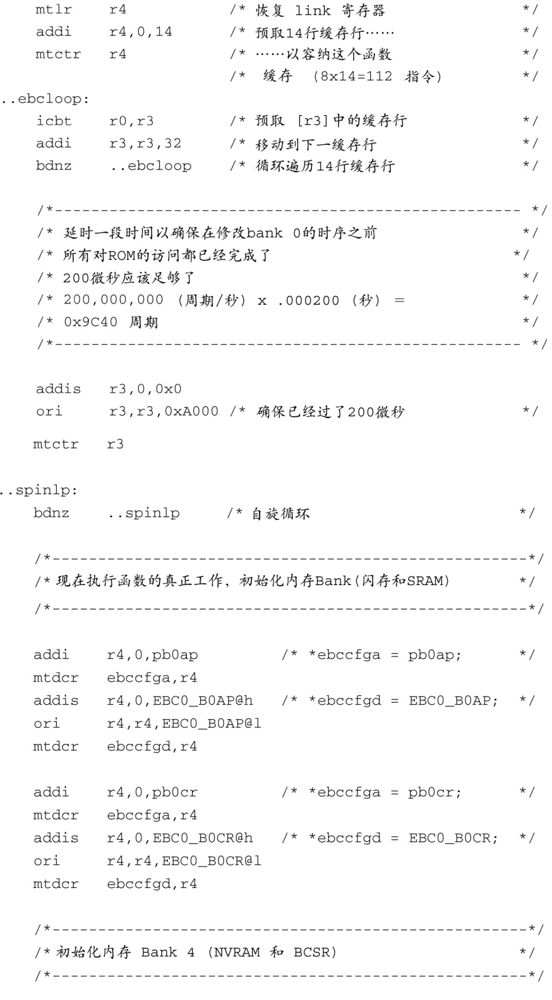
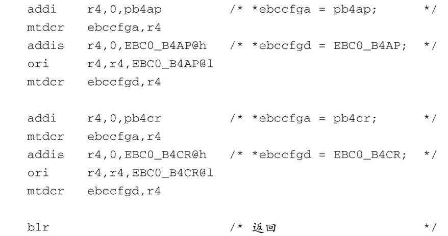

### 7.4.5　与具体板卡相关的初始化

在文件.../cpu/ppc4xx/start.S中，当代码完成了可缓存区域的初始化之后，就有机会执行与具体板卡相关的初始化了，这是第一个进行板卡初始化的时机。在这里，我们看到了一个对外部汇编语言函数的调用，函数名为 `ext_bus_cntlr_init` ：

这个函数是在文件.../board/ep405/init.S中定义的，而这个文件所处的目录是针对板卡新创建的。它提供了一个“钩子”（hook），用于非常早期的硬件初始化。这个文件是针对EP405平台定制的众多文件中的一员，它包含了与具体板卡相关的代码，用于初始化405GP的外部总线控制器。代码清单7-9中显示了这个文件的主要内容。这部分代码对405GP的外部总线控制器进行了初始化。

代码清单7-9　外部总线控制器的初始化

之所以选择代码清单7-9中的代码，是因为在底层处理器的初始化过程中有一些微妙的复杂性，而这段代码则是一个典型。我们需要认识到这段代码所处的运行环境，这很重要。它是从闪存中执行的，这时还没有DRAM可用，栈还不存在。这段代码会对控制器做重要的改变，控制器管理着对闪存的访问，而代码就是从闪存中执行的。有很多文档都说明了这个情况，如果处理器正在从闪存中执行代码，并且同时也在修改外部的总线控制器（闪存就附着在这个控制器上），这会造成错误的读取以及处理器崩溃。

解决问题的方法就在这个汇编语言函数中。看一下从标签 `..getAddr` 开始的7条汇编语言指令，它们的实际功能是使用 `icbt` 指令将自身预读（prefetch）到指令缓存中。当整个子函数被成功读入指令缓存中之后，它就可以对外部总线控制器做必要的改变而不用担心会造成处理器崩溃了，因为代码是直接从内部指令缓存执行的。代码不多，但很巧妙！这之后是一个简短的延时，以保证所有必要的指令都完全读入指令缓存中。

在预读取和延时之后，代码开始为板卡配置内存的Bank 0和Bank 4。为了正确地设置这些值，我们需要详细了解底层元件以及它们在板上的互联方式。请参考本章最后，以了解Power架构汇编器和405GP处理器的所有细节，我们这里的例子就是基于它们的。

考虑一下在没有完全理解这段代码时对它做些修改。也许你会添加几行代码，造成代码的大小超出了预读取到指令缓存中的范围。这就很可能造成崩溃（更糟糕的是，它可能只是有时会崩溃），但如果你想发现问题所在，使用调试器来单步跟踪这段代码，你是不会得到任何线索的。

下一个进行板卡初始化的时机是在分配了栈之后，而它是从处理器的数据缓存中分配的一个临时栈。下面的这条指令跳转到SDRAM控制器的初始化函数，大概位于.../cpu/ppc4xx/start.S的第727行：

执行环境目前包括一个栈指针和一些用于存储局部数据的临时内存——也就是说，这是一个部分C环境，允许开发人员使用C语言来完成一些相对复杂的任务，比如设置系统的SDRAM控制器和其他初始化工作。在EP405移植中， `sdram_init()` 的代码位于文件.../board/ep405/ep405.c中，并且已经针对这个特定的板卡和DRAM配置进行了定制。因为这个板卡上没有使用商用SIMM（Single Inline Memory Module，这是一种内存插槽），所以就不可能动态地检测出DRAM的配置（像众多U-Boot支持的其他板卡一样）。它是在 `sdram_init` 中硬编码的。

很多现成的内存DDR模块都包含一个SPD PROM（SPD代表Serial Presence Detect，串行存在性检测；PROM代表Programmable Read Only Memory，可编程的只读存储器），其中包含了一些参数，用于识别内存模块以及架构和组织。这些参数可以在程序的控制下通过I2C读取出来，供内存控制器使用。U-Boot支持这种技术，但需要针对特定的板卡做些修改。你可以在U-Boot源码中找到很多使用它的例子。配置选项 `CONFIG_SPD_EEPROM` 能够启用这个特性。你可以查找该选项以找到使用它的例子。

