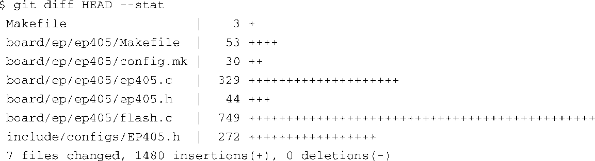

### 7.4.6　移植总结

现在，你应该能够体会到将引导加载程序移植到一个硬件平台上的难处了。简单来说，除了详细地了解底层硬件之外，别无它法。当然，我们会尽量减少完成任务所花费的时间。毕竟，我们的目标不是详细掌握硬件的每个细节，而是能够及时地给出解决方案。实际上，这正是开源如此盛行的一个重要原因。你刚才看到了，将U-Boot移植到一个新的硬件平台上是如此容易——这并不是因为你是处理器领域的专家，而是因为在我们之前，很多人已经完成了大量困难的工作。

代码清单7-10中完整地列出了移植U-Boot到EP405时所创建或修改的文件。当然，如果我们要将U-Boot移植到一个它还不支持的新硬件或新CPU上，我们要做的工作就会多很多。这里要说明一点，虽然有多余的可能，但我还是要说一下，要想在有限的时间里成功地完成移植工作，仔细了解硬件（CPU和各个子系统）和底层软件（U-Boot）是必不可少的。如果你在项目开始时就有这种意识，成功指日可待。

代码清单7-10　U-Boot移植到EP405时创建或修改的文件

回顾一下，我们是从另一个目录派生出目录.../board/ep405中的所有文件的。实际上，在这个移植过程中，我们没有从头开始创建任何文件。我们借鉴了别人的工作成果，只进行必要的定制就达到了我们的目标。

