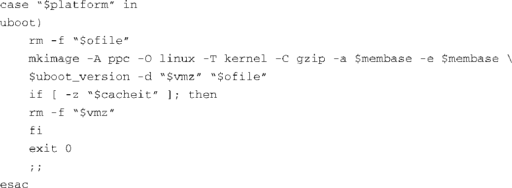
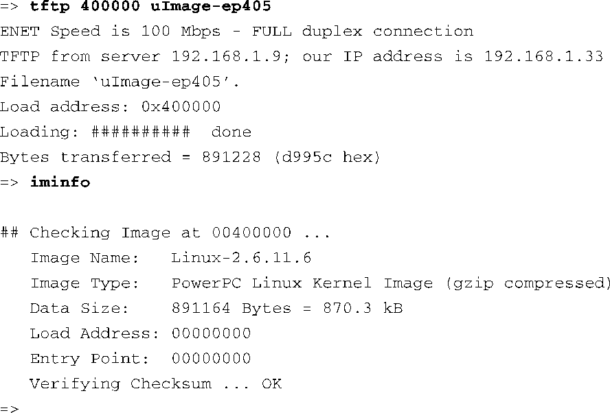

### 7.4.7　U-Boot镜像格式

现在，我们有了一个可以工作在EP405参考板上的引导加载程序，我们可以在上面加载和运行程序了。理想情况下，我们希望运行一个像Linux这样的操作系统。为此，我们需要理解U-Boot所需的镜像格式。U-Boot期望在镜像文件的前面有一个较小的头部（header），用于识别这个镜像的一些属性。U-Boot提供了一个名为mkimage的工具（U-Boot源码的一部分），用于生成这个镜像头部。

最新Linux发行版都支持构建出U-Boot可直接引导的镜像。内核源码树的arm和powerpc分支中都包含名为uImage的目标。让我们看一下Power架构的情况。

浏览一下内核源码中的.../arch/powerpc/boot/Makefile文件，我们可以看到uImage目标定义了一个对外部包装器脚本的调用，它的名字是wrapper，你已经猜到了。不需要深入到语法规则的细节中去，这个包装器脚本设置了一些默认的变量值，并最终调用mkimage。代码清单7-11列出了包装器脚本的相关处理流程。

代码清单7-11　包装器脚本中的mkimage

mkimage工具会创建U-Boot头部，并将它放置在内核镜像的前面。它将这个产生的镜像写入一个文件中，而该文件由传给mkimage的最后一个参数指定——在这里，是变量 `$ofile` 的值，而在这个例子中，它是名为uImage的文件。各个参数的含义如下。

+ `-A` 指定目标镜像的架构。
+ `-O` 指定目标镜像的操作系统，这里是Linux。
+ `-T` 指定目标镜像的类型，这里是内核。
+ `-C` 指定目标镜像的压缩格式，这里是gzip。
+ `-a` 设置U-Boot的 `loadaddress` 的值。
+ `-e` 设置U-Boot镜像的入口点。
+ `-n` 是一段让用户可以识别镜像的文本（在 `uboot_version` 变量中提供）。
+ `-d` 是指一个可执行的镜像文件，头部就是加在它的前面。

好几个U-Boot命令都会使用这个头部中的数据，用于验证镜像的完整性（U-Boot会在头部添加一个CRC签名），或是识别镜像的类型。U-Boot有一个名为iminfo的命令，用于读取头部的内容，并显示目标镜像的属性。代码清单7-12中显示了将uImage（符合U-Boot所需格式的，可引导的Linux内核镜像）通过 `tftp` 命令加载到EP405开发板上，并对这个镜像<a class="my_markdown" href="['#anchor075']">[5]</a>执行iminfo命令的结果。

代码清单7-12　U-Boot的iminfo命令

<a class="my_markdown" href="['#ac075']">[5]</a>　我们修改了uImage的名称，以反映它所对应的目标板。在这个例子中，我们在名字后面追加了-ep405，以表明它是针对那个目标设备的内核。

