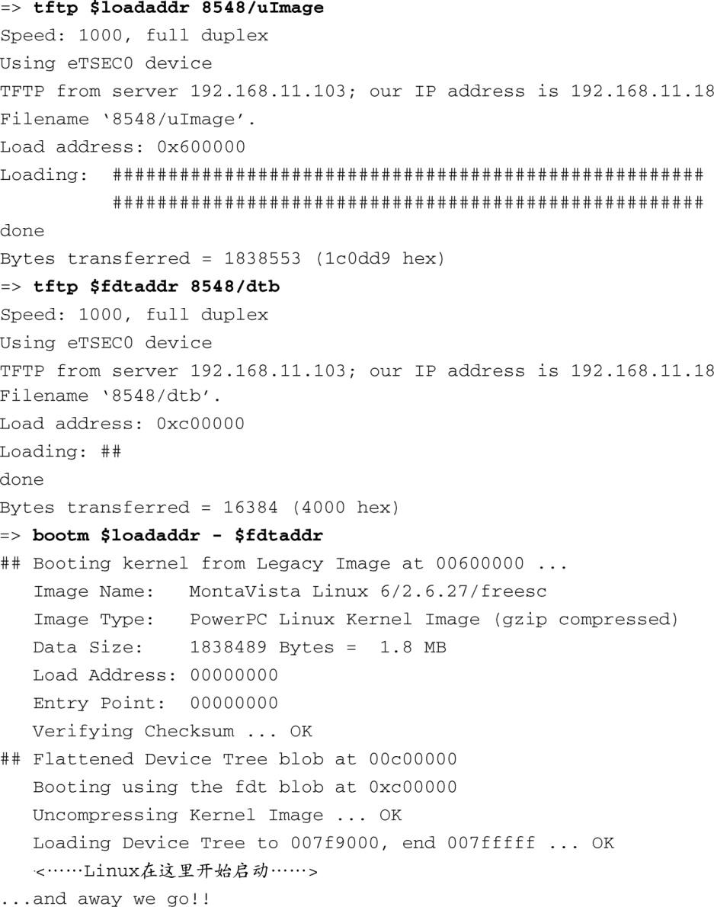

### 7.5　设备树对象（扁平设备树）

将Linux（和U-Boot）移植到新板卡上时，一个更具挑战性的方面就是要满足设备树对象（Device Tree Blob，DTB）的需求。它也被称为扁平设备树、设备树二进制文件，或简称设备树。在这里的讨论中，这些词的含义相同。DTB是一个数据库，代表了一个给定板卡上的硬件元件。它是由IBM公司的OpenFirmware规范衍生而来，并且被选择作为一种默认的机制，用于将底层硬件信息从引导加载程序传递至内核。

在使用DTB之前，U-Boot会传递一个包含板卡信息的结构体给内核，这些信息是从U-Boot的一个头文件中派生出来的，而这个头文件的内容必须和内核中的一个类似头文件完全匹配。保持它们之间的同步是非常困难的，而且扩展性也不好。这也是促成使用扁平设备树的一个因素，将它作为一种在引导加载程序和内核之间传递底层硬件细节的方法。

类似于U-Boot或其他底层固件，掌握DTB需要对底层硬件有全面的了解。你可以在网上搜索一些介绍设备树的入门文档。一个很好的起点就是Denx Software Engineering的wiki网页，本章末尾提供了相关参考文献。

首先，我们看一下在一个典型的引导过程中，DTB是如何得到使用的。代码清单7-13显示了在一个Power架构的目标设备上使用U-Boot的引导过程。这个例子中使用了飞思卡尔的MPC8548CDS系统。

代码清单7-13　在引导Linux的过程中使用U-Boot设备树对象

这里的主要区别就是我们加载了两个镜像。大的镜像（1.8 MB）是内核镜像。小一些的镜像（16 KB）是扁平设备树。注意，我们将内核和DTB分别放置在地址为0x600000和0xc00000的地方。代码清单7-13中的所有消息都是由U-Boot产生的。当我们使用 `bootm` 命令引导内核时，我们添加了第3个参数，它会告诉U-Boot我们将DTB加载到哪里。

现在，你可能想知道DTB是从哪里来的。简单的答案是，它是由板卡/架构的开发人员友情提供的，并且将它作为了Linux内核源码树的一部分。如果你看一下任何一个最新的Linux内核源码树，在powerpc分支中，你会看到一个名为.../arch/powerpc/boot/dts的目录，这就是存放DTB“源码”的地方。

复杂的答案是，你必须为自己的定制板卡提供一个DTB。找一个与你的定制板卡相似的平台，从修改这个平台开始。也许是老生常谈了，没有捷径可走。你必须深入了解硬件平台的细节，并能够熟练编写设备节点和它们的相应属性。希望本节的内容能帮助你达到这种水平。

