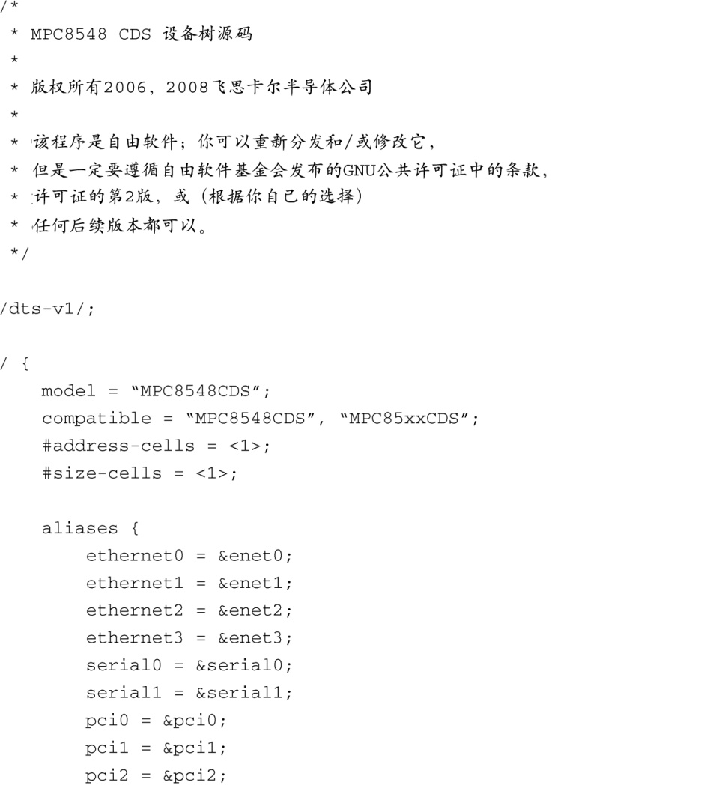
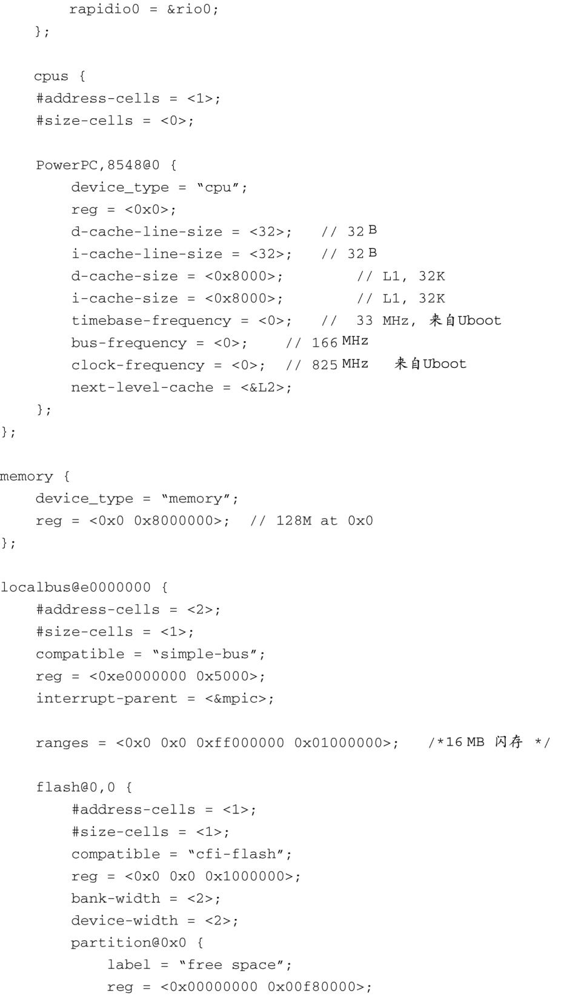
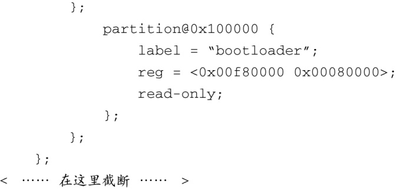
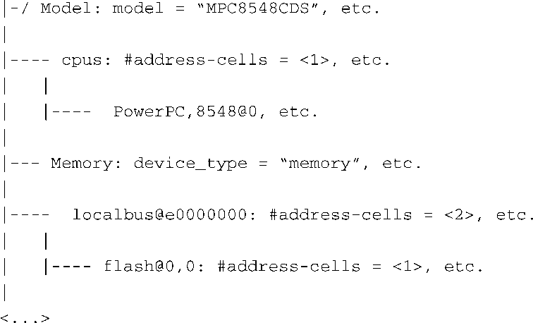

### 7.5.1　设备树源码

设备树对象是由一个特殊的编译器“编译”生成的，生成的二进制文件采用U-Boot和Linux能够理解的格式。dtc编译器一般是由嵌入式Linux发行版提供的，或者可以从以下网址下载：http://jdl.com/software。代码清单7-14显示了一个设备树源码（DTS）的片段，这来自一个最新的Linux内核源码树。

代码清单7-14　设备树源码的部分内容

这个代码清单很长，但很值得花时间研究一下。虽然看起来简洁明了，需要注意的是这个设备树源码是针对飞思卡尔公司的MPC8548CDS可配置开发系统的。作为一名嵌入式Linux开发人员，你工作的一部分就是以这个DTS为基础进行修改，使其适合基于MPC8548的定制系统。

代码清单7-14中的部分数据无须解释。扁平设备树是由设备节点组成的。设备节点是设备树中的入口，通常描述一个设备或总线。每个节点包含一组描述它的属性。这实际上就构成了一个树状结构。它可以很容易地表示为我们熟悉的树状视图，正如代码清单7-15中所显示的。

代码清单7-15　DTS的树状视图

在代码清单7-14的开始几行中，我们看到了处理器的型号，以及一个表明它和其他同系列处理器之间兼容性的属性。第一个子节点描述了CPU。CPU设备节点的很多属性都是不言自明的。例如，我们可以看到8548 CPU拥有数据和指令缓存，它们的缓存行的大小（line size）都是32 B，自身大小都是32 KB（0x8000字节）。我们还可以看到一些显示时钟频率的属性，比如 `timebase-frequency` 和 `clock-frequency` ，这两个属性都表明具体数值是由U-Boot设置的。这很正常，因为U-Boot会配置硬件时钟。

`address-cells` 和 `size-cells` 属性需要解释一下。在这里，“cell”只是一个32 bit的数。 `address-cells` 和 `size-cells` 仅仅表明在子节点中指定一个地址（或大小）所需的cell（32 bit的字段）的数量。

memory这个设备节点也没有什么神奇之处。对这个节点来说，很显然这个平台包含一个存储体，起始地址为0，大小为128 MB。

想要了解设备树语法的详细细节，请查阅本章末尾的参考文献。其中一个很有用的文档是由Power.org制作的，具体网址为<a class="my_markdown" href="['http://www.power.org/resources/downloads/Power_ePAPR_APPROVED_v1.0.pdf']">www.power.org/resources/downloads/Power_ePAPR_APPROVED_v1.0.pdf</a>。

