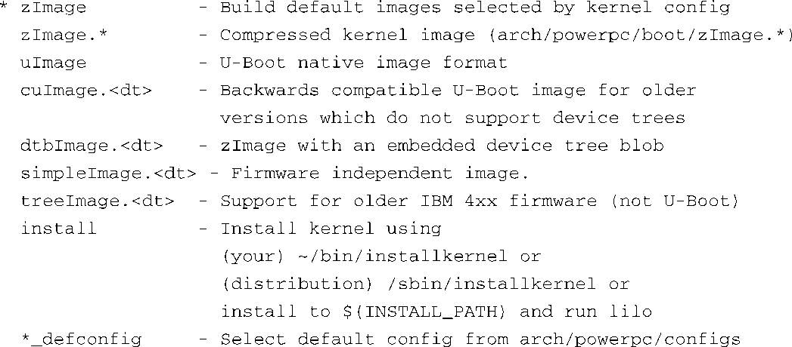

### 7.5.3　使用DTB的其他内核镜像

在Linux内核源码树的顶层目录中输入命令 `make ARCH=powerpc help` ，它会输出大量有用的帮助信息，描述了很多可用的构建目标。有几个与具体架构相关的目标会将设备树对象和内核镜像合并在一起。这样做的一个原因是，你可能会在目标设备上引导较新的内核，而目标设备上的U-Boot版本比较旧，不支持设备树对象。在一个最新的Linux内核中，代码清单7-16列出了为powerpc架构定义的一些powerpc目标。

代码清单7-16　针对powerpc架构的目标

默认情况下使用zImage，但很多目标使用了uImage。注意，其中一些目标会将设备树二进制文件包含在合成的内核镜像中。你需要自己决定哪种方式最适合你特定的平台和应用。

