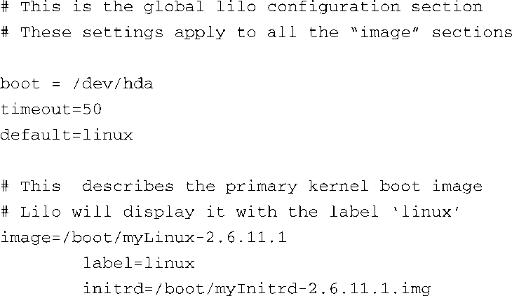
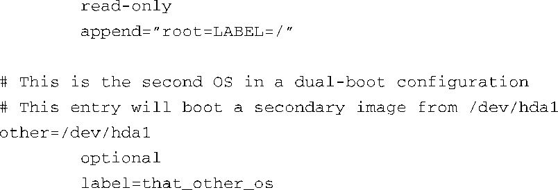

### 7.6.1　Lilo

Linux加载器（Linux loader），简称为Lilo，广泛使用于面向桌面PC平台的商业Linux发行版中。因此，它源于英特尔x86/IA32架构。Lilo包含几个组成部分，它有一个主要的引导启动程序，位于可引导磁盘驱动器的第一个扇区中。<a class="my_markdown" href="['#anchor076']">[6]</a>主要加载器的大小限制为一个磁盘扇区的大小，一般是512 B。因此，它的主要任务只是加载另一个二级加载器，并将控制权转交给它。这个二级加载器可以占据多个扇区，并完成引导加载程序的大部分工作。

<a class="my_markdown" href="['#ac076']">[6]</a>　这主要是因为历史原因。从早期的PC开始，BIOS程序只会加载磁盘驱动器的第一个扇区，并将控制权转交给它。

Lilo是由一个配置文件和一个工具程序驱动的，这个工具是Lilo可执行文件的一部分。这个配置文件只有在主机操作系统的控制下才能对它进行读写操作。也就是说，主加载器和二级加载器中的早期引导代码都不会引用这个配置文件。配置文件中的条目是在系统安装或管理时，由Lilo配置工具读取和处理的。代码清单7-17显示了一个简单的lilo.conf配置文件，它描述了一个支持Linux和Windows双系统启动的典型的安装方式。

代码清单7-17　Lilo配置文件示例: lilo.conf

这个配置文件指示Lilo配置工具使用第一个硬盘驱动器（/dev/hda）的主引导记录（master boot record）。它包含了一条延时指令，用于在超时（这里是5秒）之前等待用户按一个键，从而允许用户从操作系统镜像列表中选择一项来启动系统。如果用户在超时之前按了Tab键，Lilo会显示一个列表供用户选择。Lilo使用label标签作为每个镜像的描述文本。

镜像是由配置文件中的 `image` 标签定义的。在代码清单7-17中，主（默认）镜像是一个Linux内核镜像，文件名为myLinux-2.6.11.1。Lilo从硬盘驱动器中加载这个镜像。然后，它会加载第二个文件，用作初始的ramdisk，即文件myInitrd-2.6.11.1.img。Lilo会构造一个包含字符串 `"root=LABEL=/"` 的内核命令行，并在执行时将它传递给Linux内核。这会告诉Linux在引导完成后到哪里获取根文件系统。

