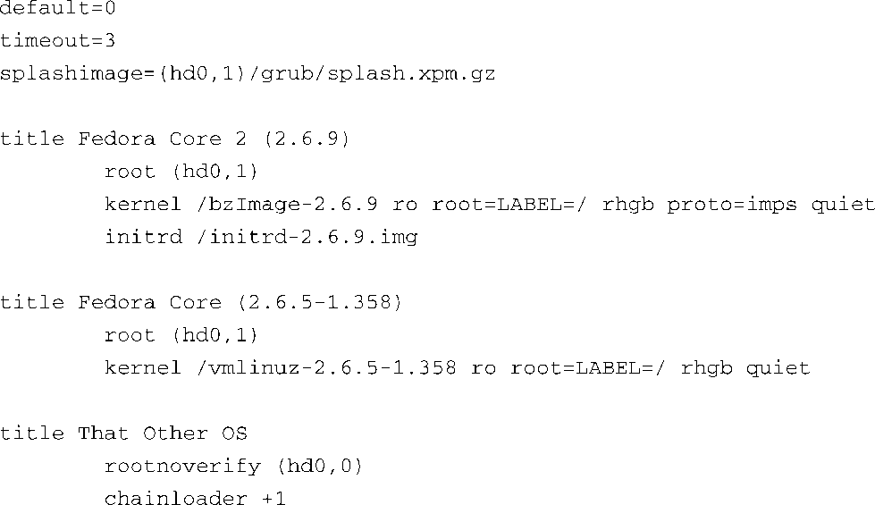

### 7.6.2　GRUB

现在许多商业Linux发行版都使用GRUB作为其引导加载程序。GRUB全称GRand Unified Bootloader（统一引导加载程序），是一个GNU项目。它具备很多Lilo所没有的高级特性。GRUB和Lilo之间最大的区别是GRUB能够理解文件系统和内核镜像的格式。此外，GRUB还能在系统引导时读取和修改其配置文件。GRUB还支持从网络引导，这对于嵌入式环境来说意义重大。GRUB在系统引导时提供了一个命令行界面，用于修改引导配置。

和Lilo一样，GRUB也是由一个配置文件驱动的。不同于Lilo的静态配置，GRUB是在引导时读取这个配置文件的。这意味着可以在引导时根据不同的系统配置改变它的行为。

代码清单7-18是一个GRUB配置文件的示例。本书就是在这个配置文件所处的PC上编写的。这个GRUB配置文件名为grub.conf <a class="my_markdown" href="['#anchor077']">[7]</a>，一般存放于一个专门用于存储引导镜像的小分区中。在这个例子所处的机器上，这个分区的目录称为/boot。

代码清单7-18　GRUB配置文件示例：grub.conf

<a class="my_markdown" href="['#ac077']">[7]</a>　有些新的发行版将这个文件称为menu.lst。

GRUB首先会展现给用户一个可引导镜像的列表。代码清单7-18中以 `title` 开头的条目就是展现给用户的镜像名称。如果在超时时间（这个例子里是3秒）内用户没有按任何键， `default` 标签所指定的镜像就会引导系统。镜像是从0开始编号的。

和Lilo不同，GRUB实际上可以读取一个给定分区上的文件系统，并从中加载一个镜像。 `root` 标签指定了根分区（根目录），grub.conf中引用的所有文件都存放在这个分区中。在这个配置文件示例中，根分区是指第一个硬盘驱动器中编号为1的分区，表示为root（hd0,1）。因为分区是从0开始编号的，所以这是指第一个硬盘驱动器的第二个分区。

镜像是由相对于根目录的文件名指定的。在代码清单7-18中，默认的引导镜像是一个Linux 2.6.9版本的内核，以及一个与之匹配的初始ramdisk镜像，名为initrd-2.6.9.img。注意，在GRUB的语法规则中，内核命令行参数和指定内核文件的kernel参数位于同一行中。

