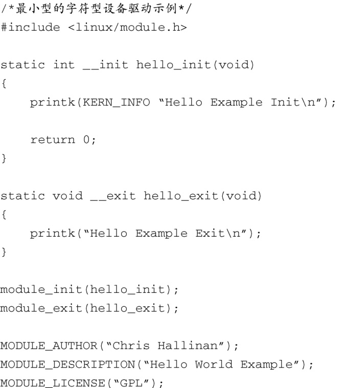

### 8.1.3　最小设备驱动程序示例

因为Linux支持可加载的设备驱动程序，所以展示一个简单的设备驱动程序框架相对比较容易。代码清单8-1显示了一个可加载的设备驱动程序模块，它包含了一个运行的内核能够加载和卸载它所必需的最简结构结构。

代码清单8-1　一个最小的设备驱动程序

代码清单8-1中显示的驱动程序中包含了足够的结构，使内核能够加载和卸载这个驱动程序，并且调用驱动程序中的初始化和退出函数。让我们看一下它是如何做到这一点的，因为这能够说明一些重要的高层次概念，了解这些概念对设备驱动程序的开发有帮助。

设备驱动程序是一种特殊的二进制模块。不同于独立的二进制可执行应用程序，我们不能简单地在一个命令行终端中执行设备驱动程序。2.6系列内核对这种二进制模块的格式有要求，它需要符合一种特殊的“内核对象”的格式。当正确构建出一个设备驱动程序模块时，这个二进制模块的文件名会包含一个.ko后缀。创建.ko模块对象所需的构建步骤和编译选项很复杂。我们在这里列出一组构建步骤，它们利用了Linux内核构建系统的强大功能，你不必成为这方面的专家就可以完成构建，而有关构建系统的详细内容超出了本书的范围。

