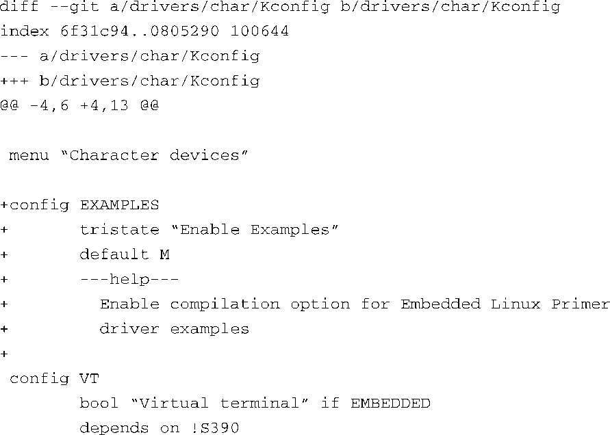
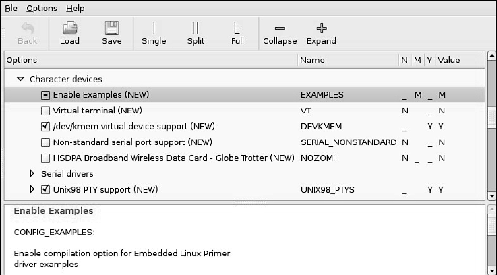
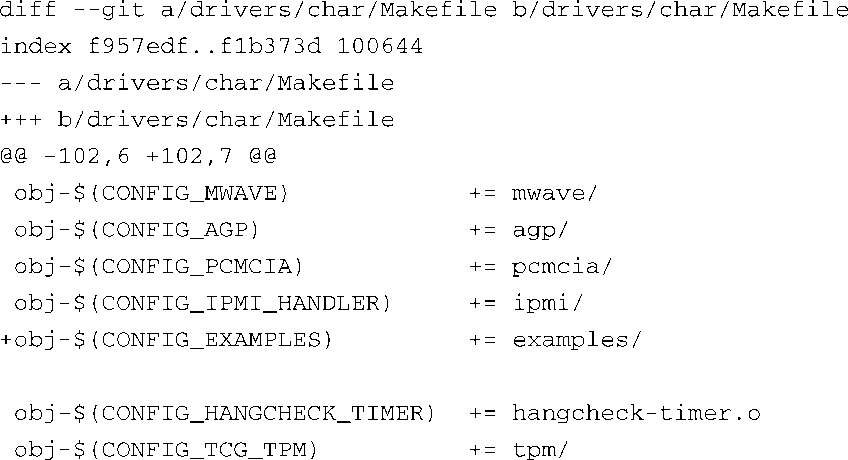
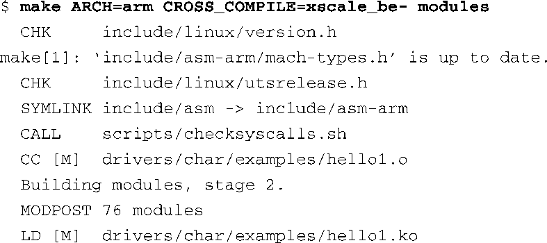

### 8.1.4　模块构建的基础设施

如果想让设备驱动程序在某个版本的内核上运行，则必须在该版本的内核中编译它。虽然加载和执行一个针对不同内核版本编译的内核模块有可能成功，但这样做是有风险的，除非你确定这个模块不会依赖于新内核的任何特性。最简单的方法就是在内核自身的源码树中构建这个模块。这可以确保当开发人员修改了内核配置后，设备驱动程序也会自动构建，并采用正确的内核配置。当然，在内核源码树之外构建驱动程序也是可能的。然而，在这种情况下，你有责任保证构建设备驱动程序所使用的配置与内核配置同步，因为你要在这个内核上运行驱动程序。常见配置一般包括编译器开关、内核头文件的位置和内核配置选项等。

对于代码清单8-1中的示例驱动程序来说，我们需要对Linux内核源码树做以下这些修改，以便它能够构建这个示例驱动。下面我们来详细解释每个步骤。

(1) 从顶层Linux源码目录开始，在目录.../drivers/char下创建一个名为examples的目录。

(2) 在内核配置中添加一个新的菜单项，由此我们能够构建examples，并可以指定将它构建成内置的或是可加载的内核模块。

(3) 修改.../drivers/char/Makefile文件，在其中添加对examples子目录的条件编译，以第(2)步中创建的菜单项的值为条件。

(4) 为examples新目录创建一个makefile，并在其中添加对 `hello1.o` 模块目标的条件编译，以第(2)步中创建的菜单项的值为条件。

(5) 以代码清单8-1中的内容创建驱动程序hello1.c源码文件。

在.../drivers/char子目录中添加exmples目录很容易。创建完这个目录后，还需要在其中创建两个文件：一个是模块源码文件本身，内容来自代码清单8-1，另一个是针对example目录的makefile文件。这个makefile相当简单，仅包含下面这一行：

在内核配置工具中添加一个菜单项要复杂一些。代码清单8-2中包含了一个补丁，当我们将它应用于最新Linux版本的.../drivers/char/Kconfig文件时，它会在其中添加一个配置菜单项，用于开启examples的配置选项。你可能对补丁文件所使用的unified diff格式不太熟悉，这里解释一下，代码清单8-2中以单个加号（+）开头的每一行都会被插入到文件（Kconfig）中，插入的位置是在指定的行（那些不以加号开头的行）之间。

代码清单8-2　针对examles目录的Kconfig补丁

当我们将这个补丁应用于.../drivers/char子目录中的Kconfig文件时，它会在其中生成一个新的内核配置选项，名为 `CONFIG_EXAMPLES` 。回顾一下第4章中有关构建Linux内核的内容，我们可以使用以下命令来启动配置工具（这个例子采用了ARM架构）：

当我们使用类似命令启动配置工具之后，新加的 `Enable Example` 配置选项会出现在Character devices（字符设备）菜单下面，补丁中也是这样指定的。因为它被定义成 `tristate` 类型，内核开发人员有3种选择。

（N）No。不编译examples。

（Y）Yes。编译examples，并将它链接到最终的内核镜像中。

（M）Module。将examples编译成一个可动态加载的模块。

图8-1显示了最终的gconfig界面，其中包含了新添加的配置选项。复选框中的短横（-）表示选择以模块方式进行编译，正如右边的M列所示。在复选框中打勾表示选择yes，该驱动程序模块会被编译成内核主体的一部分。复选框如果为空，则表示不启用该选项。

<b class="my_markdown">图8-1　带有examples模块的内核配置</b>

现在我们添加了配置选项，可以编译examples设备驱动程序模块了。接着，我们需要修改目录.../drivers/char中的makefile，从而对构建系统做出指示，让它根据配置选项 `CONFIG_EXAMPLES` 的值条件编译examples目录中的源文件。代码清单8-3中包含了一个针对此makefile的补丁，该makefile来自一个最新的Linux版本。

代码清单8-3　针对examples的makefile补丁

代码清单8-3中显示的补丁在目录.../drivers/char中的makefile中添加了一行（以+开头）。补丁中的其余行都是makefile中已存在的，这样，补丁工具就可以确定在什么位置插入新添加的行。makefile中包含的目录列表已经都搜索过了，新的examples目录就添加在它们的后面，而且这个位置看起来也合乎逻辑。除了一致性和可读性方面的考虑，位置并不重要。

完成了这些步骤之后，用于构建示例设备驱动程序的基础设施现在已经到位了。这种方法的完美之处在于它会在内核构建时自动构建驱动程序。只要选择了代码清单8-3中定义的配置选项（M或Y），这个驱动模块就会包含在构建过程中。

对于任意ARM系统，用于构建模块的命令行看起来像下面这样：

代码清单8-4中显示对模块源码进行了一些修改后，再进行构建时的输出信息（这个内核源码树中的其他模块都已经构建完毕）。

代码清单8-4　模块构建的输出信息

