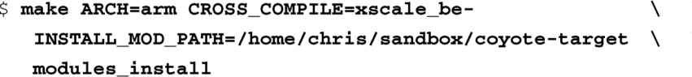

### 8.1.5　安装设备驱动程序

现在，驱动程序已经构建好了，我们可以将它加载到一个运行中的内核，或是从中卸载它，以观察它的行为。在我们加载模块之前，我们需要将它复制到目标系统中的合适位置。虽然我们可以将它放在自己所期望的任意位置，但一般都会遵循惯例。在运行的Linux系统中，这些模块会被放置到一个特定位置。和模块编译一样，最简单的方法就是让内核构建系统来帮我们做这件事。makefile中的目标modules_install会自动安装系统中的模块，确保它们的布局符合逻辑。你只需要提供期望的位置，而它会被当作默认路径的前缀。

在一个标准的Linux工作站的安装中，你也许已经知道设备驱动程序模块都位于目录/lib/modules/<kernel-version>/...中，并且它们的排序方式类似于Linux内核源码树中的设备驱动程序目录层次结构<a class="my_markdown" href="['#anchor083']">[3]</a>。想要查看字符串 `<kernel-version>` 的值，可以在目标Linux系统上执行命令 `uname`  – `r` 。如果你没有向内核构建系统提供安装前缀，默认情况下，你的模块会被安装到工作站的/lib/modules/...目录中。由于我们是嵌入式开发人员，并且我们进行的是交叉编译，这个位置也许不是你所期望的。你可以指定home目录中的一个临时位置，当模块被安装到这个位置后，再将模块手动复制到目标设备的文件系统中。或者，如果你的目标嵌入式系统使用NFS将其根文件系统挂载到本地开发工作站的一个目录上，你可以将模块直接安装到目标文件系统中。下面这个例子使用了后面一种方式：

这条命令将所有模块都安装到目录coyote-target中，在这个示例系统中，该目录通过NFS导出，并被挂载作为目标系统的根目录<a class="my_markdown" href="['#anchor084']">[4]</a>。

<a class="my_markdown" href="['#ac083']">[3]</a>　Red Hat发行版和Fedora发行版都使用了这个路径，文件系统层次结构标准（File System Hierarchy Standard）也要求使用这个路径。请参考本章末尾列出的文献。其他的发行版可能会使用文件系统中的不同位置来存放内核模块。

<a class="my_markdown" href="['#ac084']">[4]</a>　我们会在第12章详细介绍NFS，以及如何使用它来挂载根文件系统。

