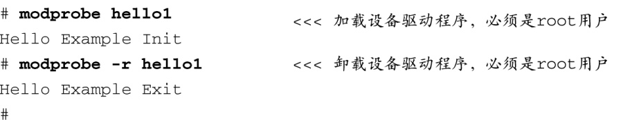

### 8.1.6　加载模块

完成了所有必要的步骤之后，我们现在就可以加载并测试设备驱动程序模块了。代码清单8-5显示了在嵌入式系统中加载和卸载设备驱动程序时的输出信息。

代码清单8-5　加载和卸载模块

你应该能够将以上输出信息和代码清单8-1中的设备驱动程序源码对应起来。这个模块的功能很简单，只是通过函数 `printk()` 向内核日志系统打印一些消息，我们可以在控制台中看到这些消息<a class="my_markdown" href="['#anchor085']">[5]</a>。加载模块后，模块初始化函数就会被调用。我们使用 `module_init()` 宏来指定模块被加载时所执行的初始化函数。我们像这样声明它：

<a class="my_markdown" href="['#ac085']">[5]</a>　如果你没有在控制台中看到这些消息，尝试关闭系统中的syslogd或是降低控制台的日志级别（loglevel）。我们会在第14章中介绍如何操作。

在我们的初始化函数中，我们只是打印了必要的hello消息并返回。然而，在一个真正的设备驱动程序中，你会在这里分配模块所需的初始资源。类似地，当我们卸载模块时（使用命令 `modprobe -r` ），退出函数会被调用。如同代码清单8-1所示，我们使用 `module_exit()` 宏来指定退出函数。在一个真正的设备驱动程序中，你会在这里撤销初始化入口函数所做的任何工作，比如释放内存或将设备返回到一个未知无害的状态。

对于示例中的简单设备驱动程序，为了能够将它动态加载到实际的内核中，我们所要做的就是这些。接下来的几节我们会在可加载设备驱动程序模块中引入一些其他功能，并说明用户空间程序如何与设备驱动程序模块进行交互。

