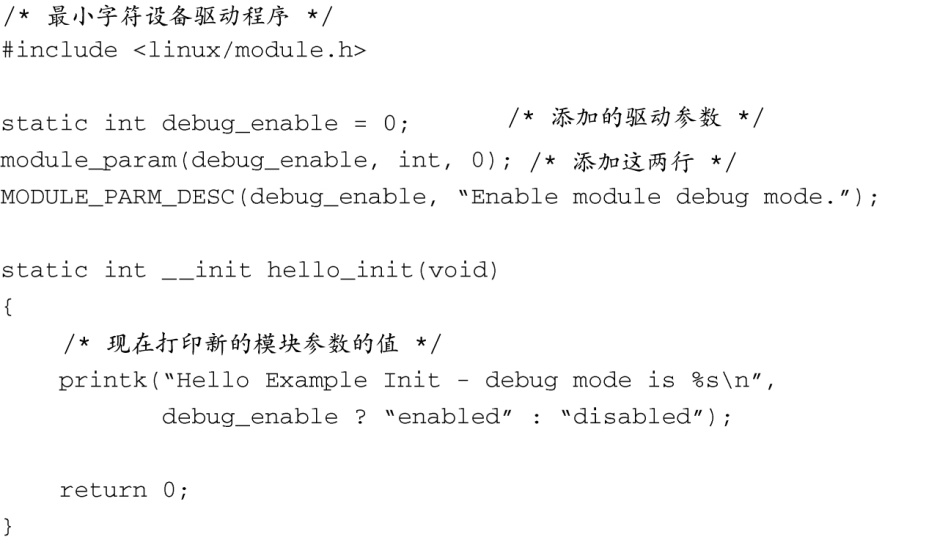
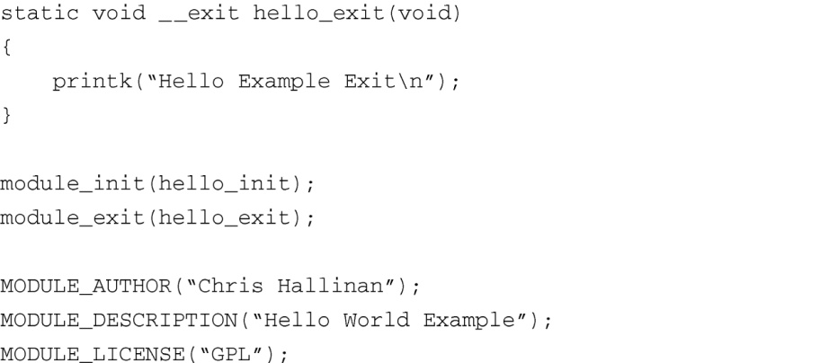

### 8.1.7　模块参数

很多设备驱动程序模块都可以接受参数，改变其行为。这样的例子包括开启调试模式、设置详细输出模式以及指定与具体模块相关的选项。实用程序insmod（以及modprobe，后面会介绍）可以在模块名称之后指定模块参数（有些上下文中也称作选项）。代码清单8-6显示了我们修改后的hello1.c的例子，在其中增加了一个模块参数，用于开启调试模式。

代码清单8-6　带一个参数的示例驱动程序

我们在示例设备驱动程序模块中添加了3行代码。第1行声明了一个静态整型变量，用于存储我们的调试标志。第2行是一个宏，在文件.../include/linux/moduleparam.h中定义的（modules.h包含了这个文件），它向内核模块子系统注册了这个模块参数。第3行也是一个宏，它向内核模块子系统注册了一个和参数相关的字符串描述。当我们在本章后面查看modinfo命令时就会明白它的作用了。

如果现在使用insmod来加载修改后的hello1.c模块（如代码清单8-6所示），并且添加 `debug_enable` 选项，我们会看到相应的输出信息。

如果我们省略了可选的模块参数，输出信息如下：

