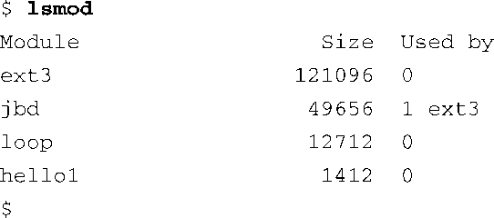

### 8.2.2　lsmod

lsmod工具也很简单。它只是显示一个格式化的列表，列出加载到内核中的所有模块。这个工具的最新版本不需要参数，仅仅是将/proc/modules<a class="my_markdown" href="['#anchor086']">[6]</a>的输出信息调整一下格式。代码清单8-7是一个使用lsmod的例子。

代码清单8-7　lsmod的输出格式

<a class="my_markdown" href="['#ac086']">[6]</a>　/proc/modules是/proc文件系统的一部分，我们将在第9章中介绍它。——译者注

注意最右边一列——“Used by”。它表示此设备驱动程序模块正在使用，并显示了依赖关系链。在这个例子中， `jbd` （包含了针对日志文件系统的日志函数）模块正由 `ext3` 模块使用，而它是很多流行Linux发行版所使用的默认的日志文件系统。这意味着ext3设备驱动程序依赖于jbd的存在。

