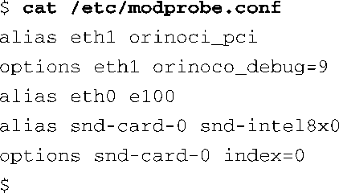

### 8.2.3　modprobe

modprobe是个巧妙的工具。代码清单8-7显示了 `ext3` 模块和 `jbd` 模块之间的关系。ext3模块依赖jbd模块。modprobe工具能够发现这种依赖关系，并且按照合适的顺序加载这些依赖模块。下面的这条命令会加载 `jbd.ko` 和 `ext3.ko` 两个驱动模块：

modprode工具有几个命令行参数，用于控制其行为。正如我们在前面所看到的，modprobe可以用于删除模块，包括某个模块所依赖的模块。下面是一个删除模块的例子，这条命令会将 `jbd.ko` 和 `ext3.ko` 都删除掉。

modprobe工具是由配置文件modprobe.conf驱动的。这可以帮助系统开发人员将设备和设备驱动程序关联起来。对于一个简单的嵌入式系统而言，modprobe.conf可能是一个空文件或只包含几行内容。modprobe工具在编译时使用了一组默认的规则，如果没有有效的modprobe.conf文件，它就使用这些默认规则创建一系列默认值。在使用modprobe工具时，如果只带一个 `-c` 选项，它就会显示出modprobe所使用的这组默认规则。

代码清单8-8显示了一个典型的modprobe.conf文件的内容，它所处的系统中包含2个以太网接口。一个是基于Prism2芯片组的无线适配器，另一个是典型的PCI以太网卡。系统中还包含一个声音子系统，它基于集成的英特尔声音芯片组。

代码清单8-8　一个典型的modprobe.conf 文件

当内核启动并发现无线芯片组时，这个配置文件会指示modprobe加载orinoco_pci设备驱动程序，并将它绑定到内核设备eth1。接着，它会将可选的模块参数 `orinoco_debug=9` 传递给设备驱动程序。当发现声卡硬件时也会采取同样的动作。注意和声卡驱动程序snd-intel8x0相关的可选参数。

注意，modprobe.conf的功能已经基本上被udev的功能所取代。我们将在第19章介绍它。然而，你可能会在旧一点的嵌入式系统中发现modprobe.conf，所以了解如何配置它也许会有用。

