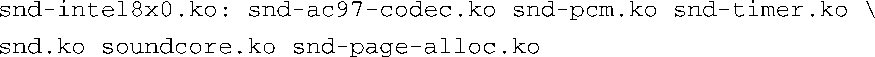

### 8.2.4　depmod

modprobe是怎么知道一个给定模块所依赖的其他模块的呢？在这个过程中，depmod工具起到了关键作用。当modprobe执行时，它会在模块的安装目录中搜索一个名为modules.dep的文件。depmod工具创建了描述模块依赖关系的文件。

这个文件列出了内核构建系统所配置的所有模块，以及每个模块的依赖信息。它采用了一种简单的文件格式，每个设备驱动程序模块占用文件的一行。如果这个模块依赖别的一些模块，这些模块会按顺序列在这个模块名称的后面。例如，在代码清单8-7中，我们看到 `ext3` 模块依赖 `jbd` 模块。文件modules.dep中的依赖关系行看起来会像是这样：

实际上，每个模块名前面会包含它在文件系统中的绝对路径，以避免产生歧义。我们已经省略了路径信息以增加可读性。一个复杂一些的依赖关系链，比如声卡驱动程序，看起来会像是这样：

再重复一遍，我们已经省略了模块名称之前的路径以增加可读性。modules.dep文件中的每个模块文件名都是一个绝对文件名，它包含了完整的路径信息，并且占用一行。因为页面的宽度有限，前面这个例子放在了两行中显示。

通常，depmod都是在内核构建时自动运行的。然而，在一个交叉开发环境中，你必须有一个交叉版本的depmod，它知道如何识别那些针对目标架构以本地模式编译的模块。另外，大多数嵌入式发行版都可以设置init脚本，使系统在每次启动时运行depmod，以保证模块间的依赖关系得到及时更新。

