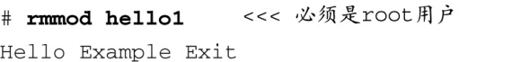

### 8.2.5　rmmod

rmmod工具也很简单。它仅仅是将一个模块从运行中的内核中删除。只需将模块名称作为参数传递给它，没有必要包含路径名或文件扩展名。例如：

这里唯一需要了解的一点是，当你使用rmmod时，它会执行模块的 `*_exit()` 函数，正如这里所显示的输出信息，它们来自代码清单8-1和代码清单8-6中的hello1.c。

需要注意的是，和modprobe不同，rmmod不会删除一个模块所依赖的模块。如果你想删除，可以使用 `modprobe -r` 。

