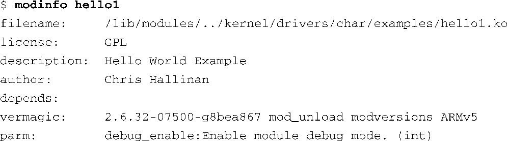

### 8.2.6　modinfo

你也许已经注意到了代码清单8-1中的框架驱动程序的最后3行，后面的代码清单8-6中也有这3行。这些宏用于在二进制模块中设置一些标签，以方便模块的管理。代码清单8-9中显示了对 `hello1.ko` 模块执行modinfo的结果。

代码清单8-9　modinfo 的输出信息

第一个字段是显而易见的：它是设备驱动程序模块的完整文件名。为了增加可读性，我们再一次截短了路径名。接下来几行的内容直接来自代码清单8-6中的最后几个宏——也就是模块描述、作者和许可信息。它们仅仅是供模块工具使用的标签而已，不会影响设备驱动程序本身的行为。可以从帮助手册和源码中进一步了解modinfo。

modinfo有一个很有用的特性，我们可以通过它了解一个模块所支持的参数。从代码清单8-9中可以看到这个模块只支持一个参数。这就是我们在代码清单8-6中添加的 `debug_enable` 。输出信息中给出了参数的名称、类型（在这里是int型）以及我们填充到 `MODULE_PARM_DESC()` 宏当中的描述文本。这非常方便，特别是对于那些不容易接触到其源码的模块。

