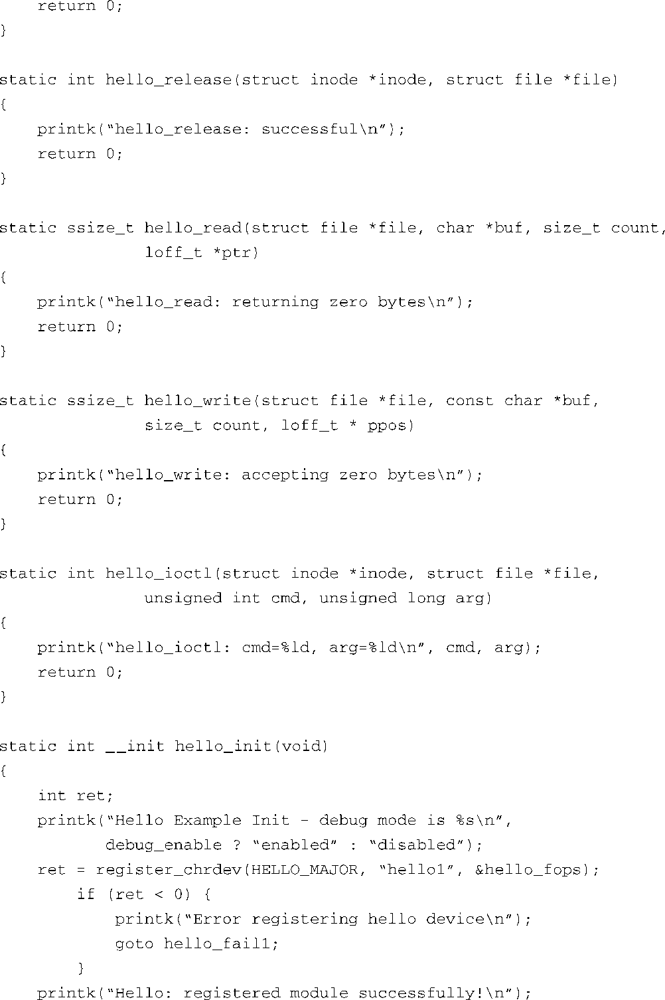

### 8.3.1　驱动程序中的文件系统操作

当设备驱动程序被加载到一个运行的内核之后，我们必须采取的首要行动就是让这个驱动做好准备，以接受后续的操作请求。 `open()` 方法就是用于这个目的。打开驱动程序后，我们需要有读写这个驱动程序的函数。驱动程序还会提供一个 `release()` 函数，用于所有操作完成后的资源清理（本质上是一个 `close()` 调用）。最后，驱动程序还会提供一个特殊的系统调用，用于和驱动程序之间的非标准通信。这被称为 `ioctl()` 。代码清单8-10在我们的示例驱动程序中加入了这些函数。

代码清单8-10　在hello.c中加入文件系统操作

这个扩展后的设备驱动程序的例子包含了很多新添加的代码行。从上面开始看，我们必须添加一个新的内核头文件，以获得文件系统操作函数的相关定义。我们还为设备驱动程序定义了一个主设备号（设备驱动程序的开发者需要注意：这种分配设备驱动程序主设备号的方式并不是很好。请参考Linux内核文档[.../Documentation/devices.txt]或是设备驱动程序方面的优秀参考书），以了解怎样合适地分配主设备号。对于这个简单的例子来说，我们只是选择了一个我们所知的，系统中未使用的主设备号。）

接下来就是4个新添加的函数——我们的 `open` 、 `close` 、 `read` 和 `write` 方法。为了保持良好的编码习惯，我们采用了一致的命名方式，这会增加代码的可读性，也更易维护。我们将新添加的方法分别命名为 `hello_open()` 、 `hello_release()` 、 `hello_read()` 和 `hello_write()` 。对于这个简单的练习而言，这些函数仅仅是向内核日志子系统打印了一条消息。

注意，我们还在函数 `hello_init()` 中添加了对另一个函数的调用。这行代码将我们的设备驱动程序注册到内核中。在调用这个注册函数时，我们传递给它一个结构体，其中包含了指向所需方法的函数指针。内核使用这个结构体（类型为 `struct file_operations` ）将我们具体的设备函数和来自文件系统的相应请求绑定到一起。当一个应用程序打开了一个由我们的设备驱动程序所代表的设备，并请求一个 `read()` 操作时，文件系统会将这个通用的 `read()` 请求和我们模块的 `hello_read()` 函数关联起来。下面几节会详细描述这个过程。

